# 继续记录

## Map

### 使用Properties
 
Properties用于读取配置
 
* .properties文件只能使用ASCII编码* 可以从文件系统和ClassPath读取
* 读取多个.properties文件，后读取的Key-Value会覆盖已读取的Key-Value
 
Properties实际上是从Hashtable派生，但只需调用`getProperty`和`setProperty`


### Set
 
Set用于存储不重复的元素集合：
 
* boolean add(E e)
* boolean remove(Object o)
* boolean contains(Object o)
* int size()
 
利用Set可以去除重复元素
 
放入Set的元素要正确实现equals()和hashCode()
 
Set不保证有序：
 
* HashSet是无序的
* TreeSet是有序的
 
实现了SortedSet接口的是有序Set

### Queue
 
队列（Queue）是一种先进先出（FIFO）的数据结构
 
实现类：ArrayDeque，LinkedList
 
操作Queue的元素的方法：
* 添加至队尾压栈：add() / offer()* 获取队列头部元素并删除：E remove() / E poll()
* 获取队列头部元素但不删除：E element() / E peek()
 
两组方法的区别：是否抛出Exception
 
避免把null添加到队列


### PriorityQueue

PriorityQueue的出队顺序与元素的优先级有关：

从队首获取元素时，总是获取优先级最高的元素

默认按元素比较的顺序排序（必须实现Comparable接口）

可以通过Comparator自定义排序算法（不必实现Comparable接口


PriorityQueue<E>具有Queue<E>接口：
• 添加元素到队尾：boolean add (E e) / boolean offer (E e) 
• 获取队列头部元素并删除：E remove () /E poll () 
• 获取队列头部元素但不删除：E element () / E peek () 

默认情况下，优先队列按照元素的自然顺序排序（例如数值或字典顺序），但我们也可以自定义优先级排序规则。

自定义对象的优先级需要实现 

自定义对象的优先级实现 Comparable 接口，来确定队列的优先级


你提供的这个代码片段实现了一个自定义的 `Comparator`，它按照 `Person` 对象的名字 **倒叙排序**。我们可以将这个代码转换为 **Lambda 表达式** 来简化写法。

### 原始代码（匿名内部类写法）

```java
Queue<Person> queue03 = new PriorityQueue<>(new Comparator<Person>() {
    @Override
    public int compare(Person o1, Person o2) {
        // 按照名字的顺序倒叙排序
        return -o1.getName().compareTo(o2.getName());
    }
});
```

### 转换为 Lambda 表达式

Lambda 表达式可以直接用来代替匿名内部类的实现，尤其是当你实现的是 **函数式接口**（如 `Comparator`）时。

```java
Queue<Person> queue03 = new PriorityQueue<>((o1, o2) -> -o1.getName().compareTo(o2.getName()));
```

### 解释

1. **匿名内部类写法**：
   `new Comparator<Person>() { ... }` 是一个匿名类，它实现了 `compare` 方法。在这个方法中，我们使用 `o1.getName().compareTo(o2.getName())` 来比较两个 `Person` 对象的名字，并通过 `-` 实现倒叙排序。

2. **Lambda 表达式写法**：
   `(o1, o2) -> -o1.getName().compareTo(o2.getName())` 这个 Lambda 表达式就是对 `Comparator` 接口的简洁实现：

   * `(o1, o2)` 是两个参数，表示队列中需要比较的两个 `Person` 对象。
   * `->` 后面的部分是实现了 `Comparator` 接口的 `compare` 方法的具体逻辑。
   * `-o1.getName().compareTo(o2.getName())` 完成倒序排序。

### 优点

* **简洁性**：Lambda 表达式减少了冗余的代码，不需要显示声明 `Comparator` 接口的实现类。
* **可读性**：Lambda 表达式用非常简洁的方式表达了排序逻辑，使代码更加紧凑和易于理解。

---

## 总结

* **匿名内部类写法**：

  ```java
  new Comparator<Person>() {
      @Override
      public int compare(Person o1, Person o2) {
          return -o1.getName().compareTo(o2.getName());
      }
  }
  ```

* **Lambda 表达式写法**：

  ```java
  (o1, o2) -> -o1.getName().compareTo(o2.getName())
  ```

**Lambda 表达式**是 Java 8 引入的一个重要特性，它极大地简化了代码，尤其是在处理像 `Comparator` 这样接口时。

---


o1和o2前面为什么不用加person对象

这个问题非常好！让我们深入探讨一下为什么在 Lambda 表达式中的 `o1` 和 `o2` 不需要显式地加上 `Person` 类型。

### 1. **Lambda 表达式的参数类型推断**

在 Lambda 表达式中，参数的类型是 **由上下文推断出来的**。也就是说，你不需要显式地声明参数类型，编译器会根据你传递给 Lambda 表达式的接口类型来推断。

在你的代码中：

```java
Queue<Person> queue03 = new PriorityQueue<>((o1, o2) -> -o1.getName().compareTo(o2.getName()));
```

#### **关键点：**

* `PriorityQueue<>` 是一个泛型类，它接收一个 `Comparator<Person>`，即 **比较 `Person` 对象的大小**。
* 由于 `Comparator` 是 `PriorityQueue` 的构造参数，编译器知道你传入的 `Comparator` 需要比较 `Person` 对象。所以，Lambda 表达式中的 `o1` 和 `o2` 自动被推断为 `Person` 类型。

---

### 2. **编译器如何推断类型**

在 Lambda 表达式 `(o1, o2) -> -o1.getName().compareTo(o2.getName())` 中：

* `o1` 和 `o2` 的类型是由 `Comparator<Person>` 接口的签名决定的。具体来说，`Comparator` 的 `compare` 方法是：

```java
int compare(T o1, T o2);
```

* 由于你使用的是 `PriorityQueue<>(new Comparator<Person>())`，编译器知道 `Comparator` 要比较的是 `Person` 类型。所以，`o1` 和 `o2` 被自动推断为 `Person` 类型。

---

### 3. **为什么不需要显式声明类型？**

Lambda 表达式的参数类型可以由编译器根据上下文自动推断，因此在大多数情况下，你不需要显式声明类型。这是 **Java 8 引入的类型推断**，使得代码更加简洁。

如果我们明确声明类型，代码会变成这样：

```java
Queue<Person> queue03 = new PriorityQueue<>((Person o1, Person o2) -> -o1.getName().compareTo(o2.getName()));
```

不过，Java 编译器能够从 `Comparator<Person>` 自动推断出 `o1` 和 `o2` 的类型，所以你可以省略类型声明，使代码更简洁。

---

### 4. **回顾泛型的类型推断**

这就像是你在使用泛型时，不需要每次都写出具体类型：

```java
List<String> list = new ArrayList<>();
```

Java 编译器会自动推断出 `ArrayList` 的泛型类型为 `String`，所以你不需要显式地写：

```java
List<String> list = new ArrayList<String>();
```

---

## 总结

* **Lambda 表达式中的参数类型**：编译器根据上下文自动推断，无需显式声明类型。
* **`o1` 和 `o2` 的类型**：由 `Comparator<Person>` 自动推断为 `Person` 类型。
* **简洁性**：省略类型使代码更简洁，但如果需要，可以显式声明类型。

---

### Deque
 
Deque实现一个双端队列（Double Ended Queue）：
 
* 既可以添加到队尾，也可以添加到队首
* 既可以从队首获取，又可以从队尾获取
 
* 添加元素到队尾：addLast(E e) / offerLast(E e)
* 取队首元素并删除：E removeFirst() / E pollFirst()
* 取队首元素但不删除：E getFirst() / E peekFirst()
 
总是调用xxxFirst / xxxLast以便与Queue的方法区分开

| 操作类型                  | Queue                           | Deque                           |
|------------------------|--------------------------------|--------------------------------|
| 添加元素到队尾            | add(E e) / offer(E e)          | addLast(E e) / offerLast(E e)  |
| 取队首元素并删除          | E remove() / E poll()          | E removeFirst() / E pollFirst()|
| 取队首元素但不删除        | E element() / E peek()         | E getFirst() / E peekFirst()   |


### Stack
 
栈（Stack）是一种后进先出（LIFO）的数据结构
 
操作栈的元素的方法：
* push(E e)：压栈* pop()：出栈* peek()：取栈顶元素但不出栈
 
Java使用Deque实现栈的功能，注意只调用push/pop/peek，避免调用Deque的其他方法
 
不要使用遗留类Stack


peek() 方法是 Stack 类中的一个常用方法，它的作用是 查看栈顶的元素，但 不移除 该元素。


### Iterator 迭代
 
for...each循环是编译器实现的Iterator模式
 
适用于for...each循环的类：
 
* 实现Iterable接口
* 返回Iterator实例
 
好处：
 
* 对任何集合都采用同一种访问模型
* 调用者对集合内部结构一无所知
* 集合类返回的Iterator对象知道如何迭代
* Iterator是一种抽象的数据访问模型

### Collections
 
Collections是JDK提供的集合工具类
 
创建空集合：emptyList / emptySet / emptyMap
 
创建单元素集合：singleton / singletonList / singletonMap
 
对List排序：sort
 
洗牌：suffle
 
创建不可变集合：unmodifiableList / unmodifiableSet / unmodifiableMap
 
创建线程安全的集合：synchronizedList / synchronizedSet / synchronizedMap（已不推荐使用）

### IO
 
IO: Input / Output
 
IO流是一种流式的数据输入/输出模型：
 
* 二进制数据以byte为最小单位在InputStream / OutputStream中单向流动
* 字符数据以char为最小单位在Reader / Writer中单向流动
* JDK的java.io包提供了同步IO功能
* JDK的java.nio包提供了异步IO功能
 
Java的IO流的接口：
 
* 字节流接口：InputStream / OutputStream
* 字符流接口：Reader / Writer

字节流一次读取一个字节，也就是一个byte的大小，
字符流顾名思义，就是一次读取一个字符，也就是一个char的大小（在读取纯文本文件的时候更加适合），

### File
 
java.io.File表示文件系统的一个文件或者目录：
 
* isFile()：是否是文件
* isDirectory()：是否是目录
 
创建File对象本身不涉及IO操作
 
获取路径／绝对路径／规范路径：getPath() / getAbsolutePath() / getCanonicalPath()
 
文件操作：
 
* canRead()：是否允许读取该文件
* canWrite()：是否允许写入该文件
* canExecute()：是否允许运行该文件
* length()：获取文件大小
* createNewFile()：创建一个新文件
* static createTempFile()：创建一个临时文件
* delete()：删除该文件
* deleteOnExit()：在JVM退出时删除该文件
 
目录操作：
 
* String[] list()：列出目录下的文件和子目录名
* File[] listFiles()：列出目录下的文件和子目录名
* File[] listFiles(FileFilter filter)
* File[] listFiles(FilenameFilter filter)
* mkdir()：创建该目录
* mkdirs()：创建该目录，并在必要时将不存在的父目录也创建出来
* delete()：删除该目录

目录 一个点 表示当前目录
两个点 表示上一级目录

## IO流相关内容

https://www.itbaima.cn/zh-CN/document/k6fmxd6qabgkwm9i?segment=4#%E6%96%87%E4%BB%B6%E5%AD%97%E8%8A%82%E6%B5%81


### OutputStream
 
OutputStream是所有输出流的超类：
 
* write(int b)写入一个字节
* write(byte[])写入byte[]数组的所有字节
* flush()方法将缓冲器内容输出
 
write()方法是阻塞（blocking）的
 
使用try(resource)可以保证OutputStream正确关闭
 
常用OutputStream：
 
* FileOutputStream
* ByteArrayOutputStream


### Filter模式
 
Filter模式是为了解决子类数量爆炸的问题

子类爆炸：
在面临复杂功能组合时，类的数量和层次可能迅速增加，导致代码变得难以管理和扩展。

假设你有一个基础类 InputStream，并且你需要在这个类的基础上添加多个功能（如缓冲、加密、压缩等）。如果每一个功能都通过继承来实现，那么你就可能创建大量的子类。例如：

BufferedInputStream（缓冲功能）

CipherInputStream（加密功能）

GZIPInputStream（压缩功能）

如果你需要组合多种功能，例如既需要缓冲又需要加密，那么你可能会有以下多个子类：

BufferedCipherInputStream

GZIPCipherInputStream

BufferedGZIPInputStream

BufferedGZIPCipherInputStream

每一个功能组合都需要一个新的类，这样类的数量会快速增长，导致管理和维护变得非常困难。

 
直接提供数据的InputStream：
 
* FileInputStream
* ByteArrayInputStream
* ServletInputStream
 
提供附加功能的InputStream从FilterInputStream派生：
 
* BufferedInputStream
* DigestInputStream
* CipherInputStream
* GZIPInputStream
 
Filter模式又称Decorator模式，通过少量的类实现了各种功能的组合
 
FilterOutputStream和FilterInputStream类似

 JDK把InputStream分为两类：
• 直接提供数据的InputStream：
FilelnputStream, ByteArrayInputStream, ServletlnputStream..
• 提供额外附加功能的InputStream称为FilterInputStream：
BufferedlnputStream, DigestlnputStream, CipherlnputStream.
•组合功能而非继承的设计模式称为Filter模式 (或者Decorator模式) 

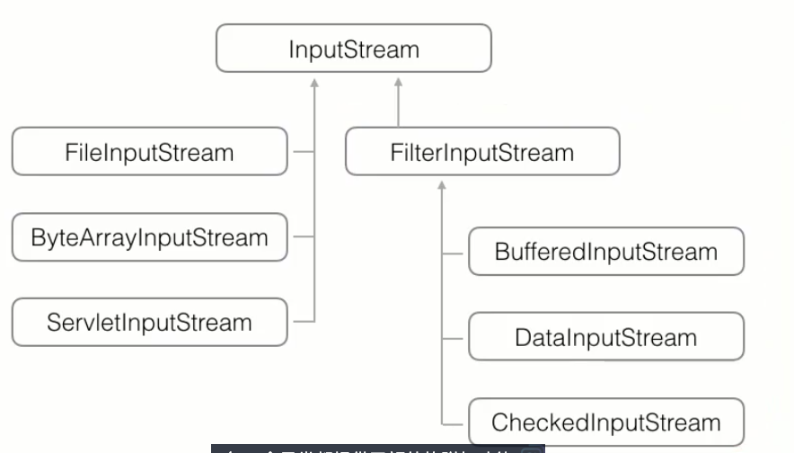

这行代码使用了 **Java 7 引入的 `try-with-resources` 语法**，并且使用了多个 **输入流（InputStream）** 的嵌套组合。它的作用是从一个 **GZIP 压缩文件** 中读取数据，解压后存储到一个字节数组中，然后将字节数据转为字符串并输出。

让我们逐步解析这段代码：

### **代码解析：**

```java
try (InputStream input = new GZIPInputStream(new BufferedInputStream(new FileInputStream("src/com/xyc/test.txt.gz")))) {
    ByteArrayOutputStream output = new ByteArrayOutputStream();
    byte[] buffer = new byte[1024];
    int n;
    while ((n = input.read(buffer)) != -1) {
        output.write(buffer, 0, n);
    }
    byte[] data = output.toByteArray();
    String text = new String(data, "UTF-8");
    System.out.println(123123);
    System.out.println(text);
}
```

---

### 1. **`try-with-resources` 语法**（自动关闭资源）

这段代码的第一行使用了 **`try-with-resources`** 语法：

```java
try (InputStream input = new GZIPInputStream(new BufferedInputStream(new FileInputStream("src/com/xyc/test.txt.gz")))) {
    // 代码块
}
```

* **`try-with-resources`** 是 Java 7 引入的语法，它的作用是确保在 `try` 语句结束时自动关闭所有声明为 `AutoCloseable` 或 `Closeable` 的资源。
* 在这种语法下，`input` 是一个 `InputStream`，它会在 `try` 块结束时自动关闭，不需要显式调用 `input.close()`。

---

### 2. **输入流的嵌套（多个流组合）**

```java
new GZIPInputStream(new BufferedInputStream(new FileInputStream("src/com/xyc/test.txt.gz")))
```

这一行代码创建了一个 **嵌套的输入流**。这里我们使用了三层输入流的嵌套：

1. **`FileInputStream`**：打开指定路径的文件，读取文件内容。这是最底层的文件读取流。

   * `new FileInputStream("src/com/xyc/test.txt.gz")` 用于从 `"test.txt.gz"` 文件中读取数据。

2. **`BufferedInputStream`**：为 `FileInputStream` 提供缓冲区。

   * 缓冲区可以提高读取性能，尤其是读取大量数据时，避免频繁的磁盘 I/O 操作。
   * `new BufferedInputStream()` 包装了 `FileInputStream`，使读取数据更高效。

3. **`GZIPInputStream`**：解压缩 `GZIP` 格式的数据。

   * `new GZIPInputStream()` 用于从一个压缩的 `GZIP` 文件中读取并解压数据。它自动解压 `GZIP` 格式的数据流，将压缩数据转换为原始数据流。
   * `test.txt.gz` 是压缩文件，`GZIPInputStream` 将解压其中的内容。

**总结**：这三层嵌套流的组合可以实现从 GZIP 文件中读取、解压并缓冲数据的功能。通常这种组合流处理压缩文件时很常见。

---

### 3. **读取数据到缓冲区**

```java
byte[] buffer = new byte[1024];
int n;
while ((n = input.read(buffer)) != -1) {
    output.write(buffer, 0, n);
}
```

* **`byte[] buffer = new byte[1024];`**：声明一个缓冲区，用于暂存从输入流读取的数据。
* **`input.read(buffer)`**：从 `GZIPInputStream` 中读取最多 `1024` 字节的数据，并存储到 `buffer` 中。

  * `read(buffer)` 会返回实际读取的字节数（`n`），如果没有更多的数据可以读取，它返回 `-1`，表示文件结束。
* **`output.write(buffer, 0, n)`**：将缓冲区中的数据写入到 `ByteArrayOutputStream`（输出流）。

---

### 4. **将数据转换为字符串**

```java
byte[] data = output.toByteArray();
String text = new String(data, "UTF-8");
```

* **`output.toByteArray()`**：`ByteArrayOutputStream` 将已经写入的数据（即解压后的字节流）转换为字节数组。
* **`new String(data, "UTF-8")`**：将字节数组 `data` 转换为 **UTF-8 编码的字符串**。这里假设数据是 UTF-8 编码的文本。

---

### 5. **输出结果**

```java
System.out.println(123123);
System.out.println(text);
```

* `System.out.println(123123)` 只是输出一个数字（可能是为了测试）。
* `System.out.println(text)` 输出从解压文件中读取并转换的文本内容。

---

### 6. **总结：整个流程**

1. **打开 GZIP 文件**：通过 `FileInputStream` 和 `BufferedInputStream` 打开源文件，并使用 `GZIPInputStream` 解压缩文件。
2. **读取文件内容**：通过 `input.read()` 从文件中按字节读取数据，使用 `byte[] buffer` 缓冲区逐步存储数据。
3. **将解压数据写入输出流**：通过 `ByteArrayOutputStream` 写入数据，这样可以存储所有读取的数据。
4. **将字节数据转换为字符串**：使用 `new String(data, "UTF-8")` 将字节数组转换为 UTF-8 编码的字符串。
5. **输出结果**：打印出解压后的文本内容。

### 常见的 `try-with-resources` 使用流：

* **`FileInputStream`**：从文件中读取字节数据。
* **`BufferedInputStream`**：为 `FileInputStream` 提供缓冲，提高效率。
* **`GZIPInputStream`**：用于解压 `GZIP` 格式的文件。
* **`ByteArrayOutputStream`**：将数据写入字节数组，可以随时转为字节数组进行进一步处理。

---

### 额外注意：

* **字符编码**：在将字节数组转为字符串时，要确保使用正确的编码方式。如果文件不是 UTF-8 编码，转换时可能会出现乱码。
* **性能优化**：使用缓冲流（如 `BufferedInputStream` 和 `ByteArrayOutputStream`）可以提高 I/O 操作的效率。

---

Java IO使用Filter模式为InputStream / OutputStream增加功能
可以把一个InputStream和任意FilterlnputStream组合
可以把一个OutputStream和任意FilterOutputStream组合
Filter模式可以在运行期动态增加功能 (又称Decorator模式) 

### Zip
 
ZipInputStream可以读取Zip流
 
JarInputStream提供了额外读取jar包内容的能力
 
ZipOutputStream可以写入Zip流
 
配合FileInputStream和FileOutputStream就可以读写Zip文件


### classpath资源
 
classpath中可以包含任意类型的文件
 
**从classpath读取文件可以避免不同环境下文件路径不一致的问题**
 
读取classpath资源：
 
```
try(InputStream input = getClass().getResourceAsStream("/default.properties")) {
    if (input != null) {
    }
}
```

把资源存储在classpath中可以避免文件路径依赖
Class对象的getResourceAsStream () 可以从classpath读取资源
需要检查返回的InputStream是否为null


### 序列化

序列化和反序列化在 Java 的实际业务开发中有广泛的应用，主要用于对象的持久化、远程通信、缓存等场景。下面是一些常见的用途：
 
序列化是指把一个Java对象变成二进制内容（byte[]）
 
Java对象实现序列化必须实现Serializable接口
 
反序列化是指把一个二进制内容（byte[]）变成Java对象
 
使用ObjectOutputStream和ObjectInputStream实现序列化和反序列化
 
readObject()可能抛出的异常：
 
* ClassNotFoundException：没有找到对应的Class
* InvalidClassException：Class不匹配
 
反序列化由JVM直接构造出Java对象，不调用构造方法
 
可设置serialVersionUID作为版本号（非必需）

1. 网络通信（RMI、Socket通信）

序列化在 网络通信 中扮演着非常重要的角色，尤其是在 远程方法调用（RMI） 和 Socket通信 中。

远程方法调用（RMI）：在分布式系统中，客户端和服务器通过网络进行通信时，可能需要传输对象。在这种情况下，Java 使用序列化将对象转换为字节流并通过网络传输，接收端再将字节流反序列化为对象。

举个例子：

客户端请求远程服务，服务器返回一个 Java 对象。这个对象会被 序列化 后通过网络传输，客户端再将其 反序列化 成原来的对象。

Socket通信：在基于 Socket 的客户端-服务器通信中，客户端和服务器可以通过传输序列化的对象来交换数据。例如，客户端通过 ObjectOutputStream 发送一个对象，服务器接收到字节流后，通过 ObjectInputStream 反序列化为对象。

场景示例：

在电子商务网站中，客户端可能需要将商品信息发送给服务器，服务器会返回订单信息。在这种情况下，通过序列化/反序列化对象可以方便地传输数据。


ObjectOutputStream负责把一个Java对象写入二进制流：

ObjectlnputStream负责从二进制流读取一个Java对象：

可序列化的Java对象必须实现java.io.Serializable接口
类似Serializable这样的空接口被称为“标记接口” (Marker Interface) 
反序列化时不调用构造方法
可设置serialVersionUID作为版本号 (非必需) 
Java的序列化机制仅适用于Java, 如果需要与其它语言交换数据, 必须
使用通用的序列化方法, 例如JSON

### Reader
 
Reader以字符为最小单位实现了字符流输入：
 
* int read() 读取下一个字符
* int read(char[]) 读取若干字符并填充到char[]数组
 
常用Reader类：
 
* FileReader：从文件读取
* CharArrayReader：从char[]数组读取
 
Reader是基于InputStream构造的，任何InputStream都可指定编码并转换为Reader：
 
```
Reader reader = new InputStreamReader(input, "UTF-8")
```

| **InputStream**             | **Reader**                      |
|-----------------------------|---------------------------------|
| 字节流，以 byte 为单位        | 字符流，以 char 为单位            |
| **读取字节** (-1, 0-255)： `int read()` | **读取字符** (-1, 0-65535)： `int read()` |
| **读取字节数组**： `int read(byte[] b)` | **读取字符数组**： `int read(char[] c)` |
| `int read(byte[] b, int offset, int len)` | `int read(char[] c, int offset, int len)` |

```java
public static void main(String[] args) {
    try (BufferedReader reader = new BufferedReader(new FileReader("test.txt"))){
        reader
                .lines()                // 第一步：将文件内容转换为 Stream
                .limit(2)               // 第二步：限制为最多读取前两行
                .distinct()             // 第三步：去重
                .sorted()               // 第四步：排序
                .forEach(System.out::println);  // 第五步：输出每一行
    }catch (IOException e) {
        e.printStackTrace();      // 异常处理
    }
}

```

Reader定义了所有字符输入流的超类
FileReader实现了文件字符流输入
CharArrayReader在内存中模拟一个字符流输入
Reader是基于InputStream构造的：
FileReader使用系统默认编码, 无法指定编码
可以通过InputStreamReader指定编码


### Writer
 
Writer以字符为最小单位实现了字符流输出：
 
* write(int c) 写入下一个字符
* write(char[]) 写入char[]数组的所有字符
 
常用Writer类：
 
* FileWriter：写入文件
* CharArrayWriter：写入char[]数组
 
Writer是基于OutputStream构造的，任何OutputStream都可指定编码并转换为Writer：
 
```
Writer writer = new OutputStreamWriter(output, "UTF-8")
```
| **OutputStream**       | **Writer**           |
|------------------------|----------------------|
| **字节流，以byte为单位** | **字符流，以char为单位** |
| 写入字节（0~255）: `void write(int b)` | 写入字符（0~65535）: `void write(int c)` |
| 写入字节数组: `void write(byte[] b)` | 写入字符数组: `void write(char[] c)` |
| `void write(byte[] b, int offset, int len)` | `void write(char[] c, int offset, int len)` |
|                        | `void write(String s)` |


• Writer定义了所有字符输出流的超类
• FileWriter实现了文件字符流输出
• CharArrayWriter在内存中模拟一个字符流输出
• Writer是基于OutputStream构造的：
FileWriter使用系统默认编码, 无法指定编码
可以通过OutputStreamWriter指定编码
• 使用try (resource) 保证Writer正确关闭


### 概念
 
理解日期、时间和时刻
 
理解时区的概念
 
**理解夏令时，同一地区用GMT/UTC和城市表示的时区可能导致时间不同**
 
理解Locale用来针对当地用户习惯格式化日期、时间、数字、货币等

### Date
 
Epoch Time：从1970-01-01 00:00:00 GMT+0:00开始到现在的秒数
 
JDK有新旧两套API处理日期和时间
 
java.util.Date表示日期和时间，内部使用long表示epoch毫秒数
 
Date和long的转换
 
SimpleDateFormat：用于Date和String的解析和格式化
 
格式化字符串的定义：
 
https://docs.oracle.com/javase/8/docs/api/java/text/SimpleDateFormat.html
 
Locale表示用户所在地区的日期、时间、数字、货币等格式。

计算机中用Epoch time来存储时间
Epoch Time： 从1970年1月1日零点 (格林威治时区/ GMT+00:00) 到现在经历的秒数, 例如：
北京 2016-11-20 8:15:01= 1479600901
• 伦敦 2016-11-20 0:15:01=1479600901

java.util.Date的问题：
• 不能转换时区
• 日期和时间的加减
• 两个日期相差多少天
•计算某个月第一个星期一

• 理解epoch time
• Java有两套日期和时间的API：
• java.util.Date/Calendar
• java.time
• 正确使用java.util.Date：
• Date和long的转换
• Date和String的转换：SimpleDateFormat

### Calendar
 
Calendar和Date、long可以互相转换
 
Calendar可以用set/get设置和获取指定字段
 
Calendar可以实现：
 
* 设置特定的日期和时间
* 设置时区并获得转换后的时间
* 加减日期和时间
 
TimeZone表示时区，getAvailableIDs()可以枚举所有有效的时区ID

### Calendar
 
Calendar和Date、long可以互相转换
 
Calendar可以用set/get设置和获取指定字段
 
Calendar可以实现：
 
* 设置特定的日期和时间
* 设置时区并获得转换后的时间
* 加减日期和时间
 
TimeZone表示时区，getAvailableIDs()可以枚举所有有效的时区ID

### LocalDateTime

java.time提供了新的API：

* LocalDate
* LocalTime
* LocalDateTime
* ZonedDateTime
* ZoneId
* Instant
* Formatter

新API特点：

* 严格区分日期和时间
* 不变类
* 修复了Month和Week的常量值

LocalDate：日期

LocalTime：时间

LocalDateTime：日期＋时间

DateTimeFormatter：格式化日期和时间

默认按照ISO 8601解析和格式化

可以对日期和时间进行加减、调整、判断先后，计算Period

LocalDateTime没有时区信息，无法与long进行转换


LocalDateTime无法与long进行转换
•因为LocalDateTime没有时区, 无法确定某一时刻
• ZonedDateTime有时区, 可以与long进行转换


`TemporalAdjusters` 是 Java 8 引入的一个工具类，位于 `java.time.temporal` 包中。它提供了一些静态方法，用于在 `Temporal` 对象（如 `LocalDate`, `LocalDateTime`, `ZonedDateTime` 等）上执行常见的日期调整操作。

### 1. **`TemporalAdjusters` 类简介**

`TemporalAdjusters` 类主要通过一些预定义的调整器（adjusters）来帮助你修改 `Temporal` 对象。`Temporal` 是一个接口，代表所有日期和时间相关的类（如 `LocalDate`, `LocalDateTime` 等）。

这个类中的方法返回一个 `TemporalAdjuster` 接口的实现，`TemporalAdjuster` 是一个功能接口，定义了 `adjustInto` 方法，该方法可以将某个日期或时间调整为新的值。

### 2. **常用的 `TemporalAdjusters` 方法**

`TemporalAdjusters` 提供了许多静态方法来简化日期和时间的常见调整任务。以下是一些常见的方法：

* **`firstDayOfMonth()`**

  * **作用**：返回该日期所在月的第一个日期。
  * **示例**：

    ```java
    LocalDate date = LocalDate.of(2026, 2, 3);
    LocalDate firstDay = date.with(TemporalAdjusters.firstDayOfMonth());
    System.out.println(firstDay);  // 输出: 2026-02-01
    ```

* **`lastDayOfMonth()`**

  * **作用**：返回该日期所在月的最后一个日期。
  * **示例**：

    ```java
    LocalDate date = LocalDate.of(2026, 2, 3);
    LocalDate lastDay = date.with(TemporalAdjusters.lastDayOfMonth());
    System.out.println(lastDay);  // 输出: 2026-02-28
    ```

* **`firstDayOfNextMonth()`**

  * **作用**：返回下一个月的第一个日期。
  * **示例**：

    ```java
    LocalDate date = LocalDate.of(2026, 2, 3);
    LocalDate firstDayNextMonth = date.with(TemporalAdjusters.firstDayOfNextMonth());
    System.out.println(firstDayNextMonth);  // 输出: 2026-03-01
    ```

* **`lastDayOfNextMonth()`**

  * **作用**：返回下一个月的最后一个日期。
  * **示例**：

    ```java
    LocalDate date = LocalDate.of(2026, 2, 3);
    LocalDate lastDayNextMonth = date.with(TemporalAdjusters.lastDayOfNextMonth());
    System.out.println(lastDayNextMonth);  // 输出: 2026-03-31
    ```

* **`next(DayOfWeek dayOfWeek)`**

  * **作用**：返回下一个指定星期几的日期。
  * **示例**：

    ```java
    LocalDate date = LocalDate.of(2026, 2, 3);
    LocalDate nextMonday = date.with(TemporalAdjusters.next(DayOfWeek.MONDAY));
    System.out.println(nextMonday);  // 输出: 2026-02-09 (下一个星期一)
    ```

* **`previous(DayOfWeek dayOfWeek)`**

  * **作用**：返回上一个指定星期几的日期。
  * **示例**：

    ```java
    LocalDate date = LocalDate.of(2026, 2, 3);
    LocalDate previousMonday = date.with(TemporalAdjusters.previous(DayOfWeek.MONDAY));
    System.out.println(previousMonday);  // 输出: 2026-02-02 (上一个星期一)
    ```

* **`firstInMonth(DayOfWeek dayOfWeek)`**

  * **作用**：返回该月中第一个指定的星期几。
  * **示例**：

    ```java
    LocalDate date = LocalDate.of(2026, 2, 3);
    LocalDate firstMondayOfMonth = date.with(TemporalAdjusters.firstInMonth(DayOfWeek.MONDAY));
    System.out.println(firstMondayOfMonth);  // 输出: 2026-02-02 (该月第一个星期一)
    ```

* **`dayOfWeekInMonth(int ordinal, DayOfWeek dayOfWeek)`**

  * **作用**：返回该月中第 `ordinal` 个指定星期几。
  * **示例**：

    ```java
    LocalDate date = LocalDate.of(2026, 2, 3);
    LocalDate thirdTuesdayOfMonth = date.with(TemporalAdjusters.dayOfWeekInMonth(3, DayOfWeek.TUESDAY));
    System.out.println(thirdTuesdayOfMonth);  // 输出: 2026-02-17 (该月第三个星期二)
    ```

### 3. **`TemporalAdjuster` 接口**

* `TemporalAdjuster` 是一个函数式接口，它的核心方法是 `adjustInto(Temporal temporal)`，该方法允许你将 `Temporal` 对象进行调整，返回一个调整后的 `Temporal` 对象。

**示例**：

```java
TemporalAdjuster adjuster = TemporalAdjusters.firstDayOfNextMonth();
LocalDate adjustedDate = LocalDate.of(2026, 2, 3).with(adjuster);
System.out.println(adjustedDate);  // 输出: 2026-03-01
```

### 4. **自定义调整器**

除了 `TemporalAdjusters` 提供的标准调整器外，你还可以自定义调整器。只需实现 `TemporalAdjuster` 接口，并覆盖 `adjustInto` 方法即可。

**示例**：

```java
TemporalAdjuster customAdjuster = (temporal) -> temporal.plusDays(10);
LocalDate adjustedDate = LocalDate.of(2026, 2, 3).with(customAdjuster);
System.out.println(adjustedDate);  // 输出: 2026-02-13 (原日期加上10天)
```

### 总结

`TemporalAdjusters` 提供了丰富的预定义调整器，用于常见的日期调整需求，极大简化了日期的操作。通过这些调整器，可以轻松地获取月份的第一天、最后一天，调整到下一个或上一个星期几，或者按指定条件对日期进行其他的调整。

### ZonedDateTime
 
ZonedDateTime = LocalDateTime + ZoneId
 
ZonedDateTime可以做时区转换：withZoneSameInstant
 
ZoneId：新的时区对象
 
Instant：时刻，可以转换为long（注意单位是秒）
 
ZonedDateTime、Instant和long可以互相转换
 
Period和Duration表示一段时间，可用于日期和时间的加减
 
其它底层API：
 
* ZoneOffset
* OffsetDateTime
* OffsetTime
* ChronoLocalDate
* ChronoLocalDateTime

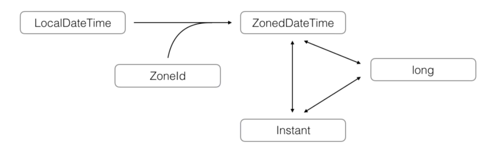

这张图片展示了 `java.time` 包中的几个重要类之间的关系。具体来看，图中涉及到以下类和概念：

1. **`LocalDateTime`**

   * 表示 **本地日期和时间**，即没有时区信息的日期时间。它包含了年、月、日、小时、分钟、秒和纳秒的值，但没有时区信息。
   * 它可以通过与 `ZoneId` 结合来转换为带时区的日期时间。

2. **`ZonedDateTime`**

   * 表示 **带时区的日期和时间**。它结合了日期时间和时区信息，并能够根据特定的时区（`ZoneId`）计算出准确的时间。
   * `ZonedDateTime` 可以通过 `LocalDateTime` 和 `ZoneId` 的结合来创建。例如，将一个没有时区的 `LocalDateTime` 和一个 `ZoneId` 结合，就能得到一个带时区的 `ZonedDateTime`。

3. **`ZoneId`**

   * 表示 **时区标识符**，例如 `Europe/Paris` 或 `Asia/Tokyo`。`ZoneId` 用于指定一个时区，以便将 `LocalDateTime` 转换为 `ZonedDateTime`。

4. **`Instant`**

   * 表示自 **1970年1月1日 UTC（Unix纪元）以来的秒数**。它是一个绝对的时间点，通常用于表示与时区无关的瞬时时间。
   * `ZonedDateTime` 和 `Instant` 之间是双向转换的，可以相互转换。`ZonedDateTime` 包含时区信息，可以转换为 `Instant`（即从 `ZonedDateTime` 到 `Instant` 可以得到准确的时间点）。

5. **`long`**

   * `long` 在此图中代表时间戳，以秒或毫秒为单位表示的时间。`Instant` 可以转换为一个 `long` 类型的值，表示自 Unix 纪元以来的秒数。

### 关系总结：

* `LocalDateTime` 与 `ZoneId` 结合后可以转换为 `ZonedDateTime`，后者包含时区信息。
* `ZonedDateTime` 可以与 `Instant` 相互转换，`Instant` 是以秒为单位的时间戳。
* `Instant` 可以表示为 `long` 类型，即 Unix 纪元以来的秒数。

图中的箭头表示了这些类之间的转换关系和它们如何互相依赖或关联。


## 正则表达式
### 正则表达式 (Regular Expression)
 
正则表达式可以用字符串来描述规则，并用来匹配字符串：
 
* 正则表达式是一个字符串
* 正则表达式用字符串描述一个匹配规则
* 使用正则表达式可以快速判断给定的字符串是否符合匹配规则
* Java内建正则表达式引擎java.util.regex

### 正则表达式匹配规则
 
* 精确匹配
* \d：0-9
* \w：a-z，A-Z，0-9，_
* \s：空格，Tab键
* \D：非\d 可以匹配一个 非数字
* \W：非\w 可以匹配一个 除了字母、数字或者下划线之外的 符号
* \S：非\s 可以匹配一个 非空白字符
* *：任意个字符
* +：至少一个字符
* ?：0个或1个字符
* {n}：n个字符
* {m,n}：m-n个字符
* {n,}：至少n个字符
* 特殊符号.可以匹配一个任意字符：“a.c"

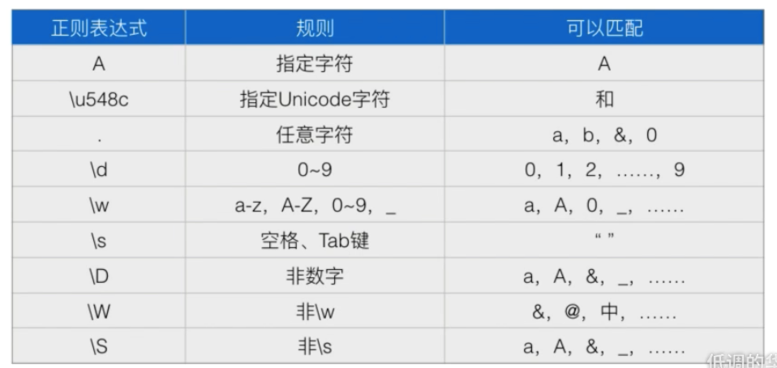

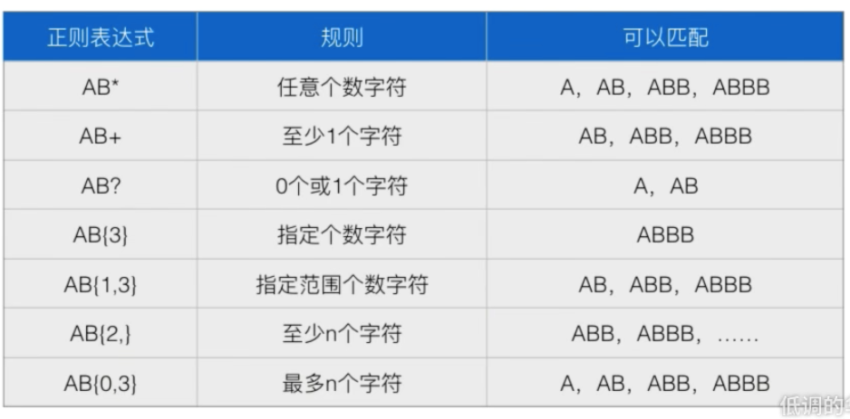

如果要转化为java的字符串的话 需要把单斜杠转化为双斜缸

精确匹配：“a\u548cc”, 非ASCII字符用\u####表示
表示精确匹配 "a和c"

正则表达式在线工具网站：https://regexr.com

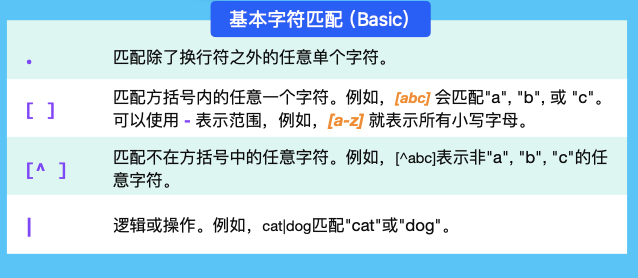

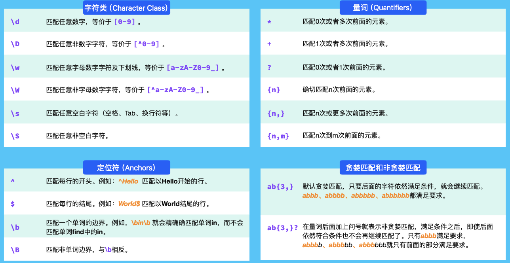

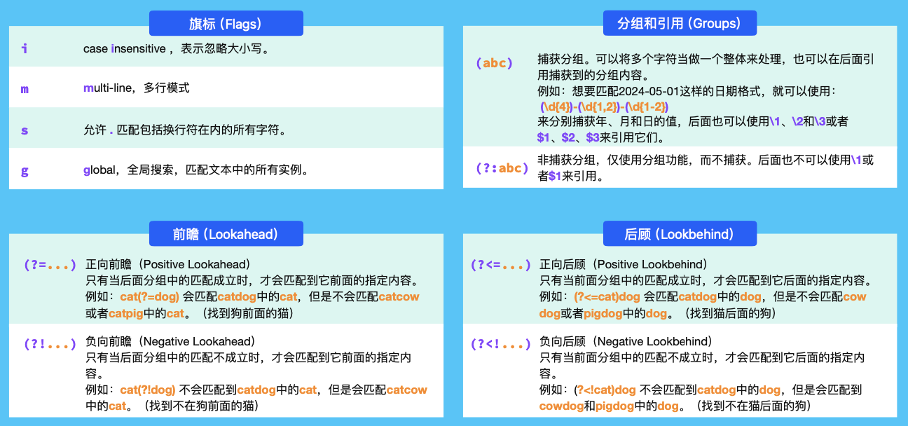

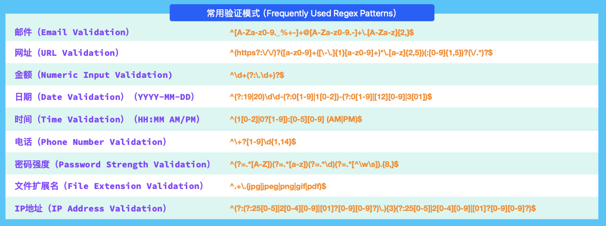


### 正则表达式复杂匹配规则
 
* ^：字符串开头
* $：字符串结束
* [ABC]：[…]内任意字符  一个中括号括起来的规则 是只能匹配一个字符
* [A-F0-9xy]：指定范围的字符
* [^A-F]：指定范围外的任意字符 表示除了A-F以外的字符
* AB|CD：可以匹配AB或CD

* String regex = "[ABC]+";  // 匹配 1 个或多个 A/B/C
* String regex = "[ABC]{2,4}";  // 匹配 2~4 个 A/B/C

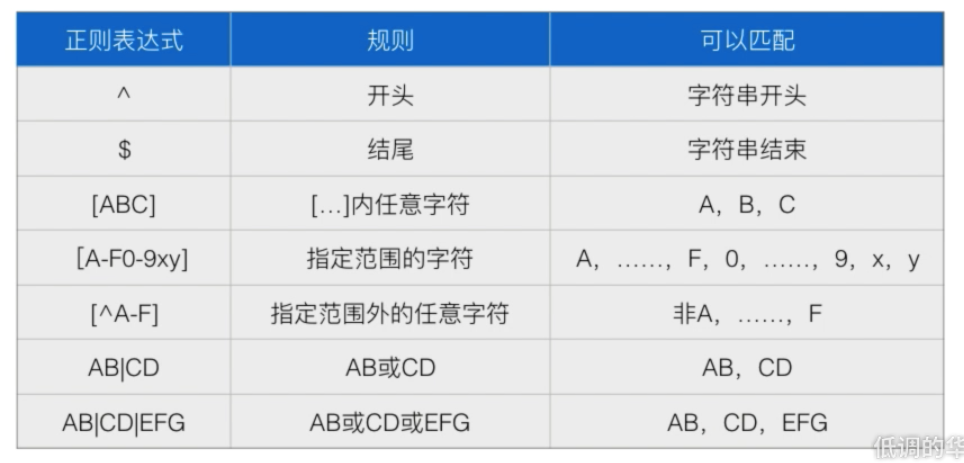


### 正则表达式分组匹配


反复使用一个正则表达式字符串进行快速匹配效率较低：
• 可以把正则表达式字符串编译为Pattern对象

正则表达式分组可以通过Matcher.group(n)对象快速提取子串：
 
* group(0)表示匹配的整个字符串
* group(1)表示第1个子串
* group(2)表示第2个子串
 
以此类推

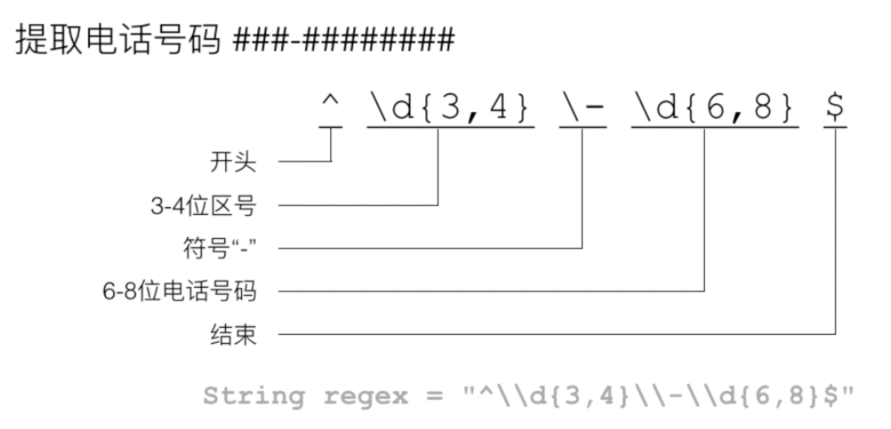

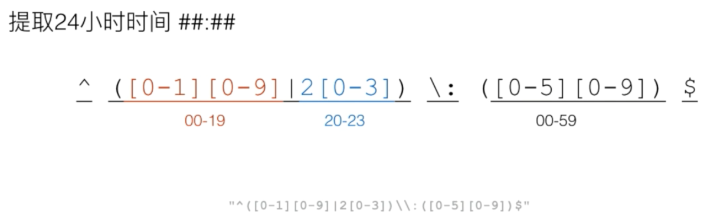

### 正则表达式非贪婪匹配
 
* 正则表达式匹配默认使用贪婪匹配 : 尽可能多的向后匹配
* 使用?表示对某一规则进行非贪婪匹配
* 注意区分?的含义，例如`\d??`

