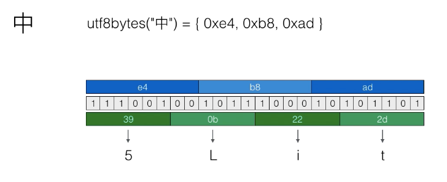
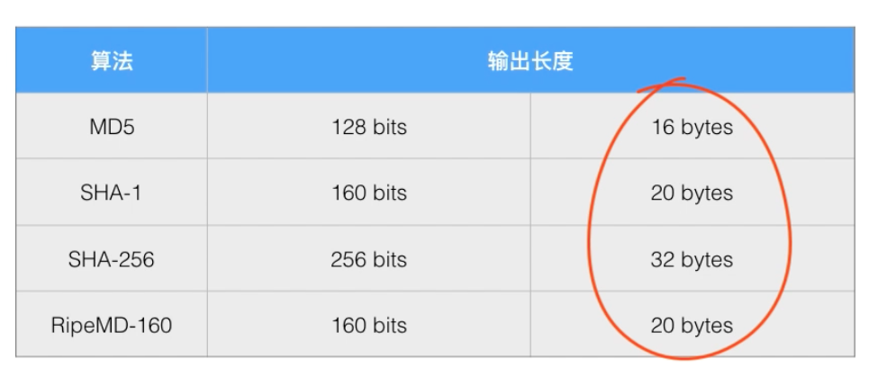
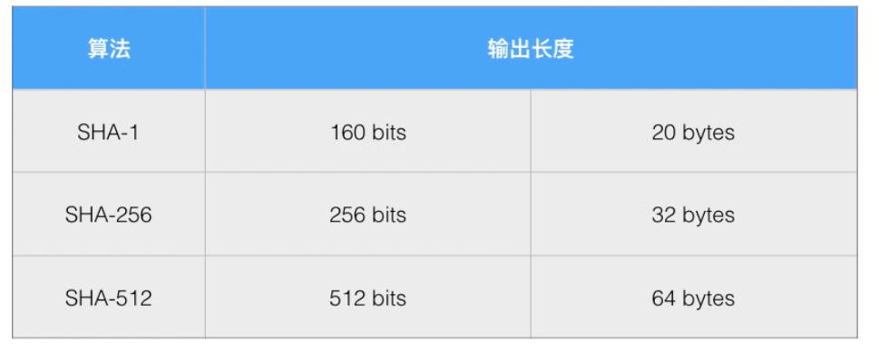
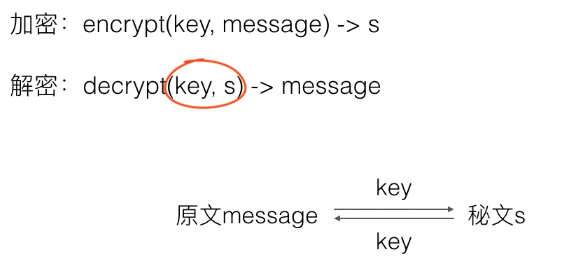
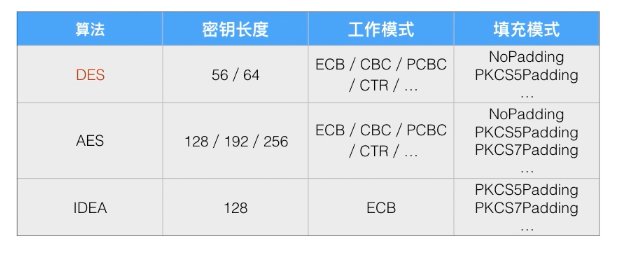
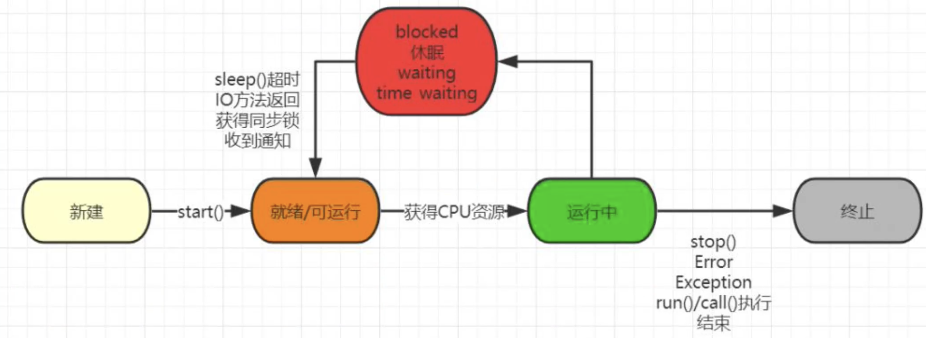

java 数据安全
### 数据安全
 
* 防窃听
* 防篡改
* 防伪造
 
现代计算机加密是建立在严格的数学理论基础上的。

### URL编码
 
URL编码是编码算法，不是加密算法
 
URL编码的目的是把任意文本数据编码为%前缀表示的文本

URL编码是浏览器发送数据给服务器时使用的编码：
• keyl=value1&key2=value2&key3=value3
• 9=%E4%B8%AD%E6%96%87

URL编码规则：
•A~Z, a-Z, 0-9以及一
.*保持不变
•其它字符以%XX表示：
•<：%3C
• 中：%E4%B8%AD (UTF-8: 0xe4b8ad) 

URL编码是编码算法, 不是加密算法
URL编码的目的是把任意文本数据编码为%前缀表示的文本, 
编码后的文本仅包含A~Z, a~Z, 0~9, -_*, %, 
便于浏览器和服务器处理

### Base64编码
 
Base64是编码算法，不是加密算法
 
Base64编码的目的是把任意二进制数据编码为文本（长度增加1/3）
 
其它编码：Base32，Base48，Base58

什么是Base64：
• 一种把二进制数据用文本表示的编码算法
• String base64Encode (bytel］ data) 
• bytel [] {Oxe4, 0xb8, Oxad} -> "5Lit"



目的：
•一种用文本 (A-Z, a-Z, 0-9, +/=) 表示二进制内容的方式
•适用于文本协议
•效率下降
应用：
•电子邮件协议

### 摘要算法
 
摘要算法 / 哈希算法 / 数字指纹 / Hash / Digest
 
计算任意长度数据的摘要，输出固定长度
 
相同的输入始终得到相同的输出
 
不同的输入尽量得到不同的输出
 
### 碰撞
 
两个不同的输入得到了相同的输出
 
### Hash算法的安全性：
 
* 碰撞率低
* 不能猜测输出
* 输入的任意一个bit的变化会造成输出完全不同
* 很难从输出反推输入（只能依靠暴力穷举）
 
### MD5摘要算法
 
* 验证原始数据是否被篡改
 
* 存储用户口令
 
* 需要防止彩虹表攻击

摘要算法 (哈希算法 / Hash / Digest / 数字指纹) ：
•计算任意长度数据的摘要 (固定长度) 
• 相同的输入数据始终得到相同的输出
• 不同的输入数据尽量得到不同的输出
目的：
• **验证原始数据是否被篡改**

Java的Object.hashCode () 方法就是一个摘要算法：
• 输入：任意数据
•输出：固定长度数据 (int, byte［4］) 
• 相同的输入得到相同的输出：
equals / hashCode

碰撞：
**两个不同的输入得到了相同的输出**
hash ("abc") =0×12345678
hash ("xyz") = 0x12345678

Hash算法的安全性：
• 碰撞率低
•不能猜测输出
• 输入的任意一个bit的变化会造成输出完全不同
• 很难从输出反推输入 (只能依靠暴力穷举) 



MD5的用途：
• **验证文件完整性**

MD5存储用户口令
• 系统不存储用户原始口令
• 系统存储用户原始口令的MD5
如何判断用户口令是否正确：
• 系统计算用户输入的原始口令的MD5并与数据库存储的MD5对比
•相同：口令正确
•不相同：口令错误

salt值的由来：
https://www.bilibili.com/video/BV134411T7rq?spm_id_from=333.788.player.switch&vd_source=4fd29620ab97a080af7ee392e19b0fcb&p=4

黑客有一个彩虹表（常用密码和对应的md5值）

如果加入一个随机数（也就是盐值）在生成md5值 就不容易被攻击

• MD5是一种常用的哈希算法
输出128 bits / 16 oytes
• 常用于验证数据完整性
• 用于存储口令时要考虑彩虹表攻击

### SHA1
 
SHA-1摘要算法：输出160bits，20bytes
 
其它摘要算法：
 
* SHA-256
* SHA-512
* RipeMD160
 
查询JDK摘要算法名称：
 
http://docs.oracle.com/javase/8/docs/technotes/guides/security/StandardNames.html#MessageDigest




SHA-1算法是比MD5更安全的哈希算法
其它哈希算法：
SHA-256 / SHA-512/ RipeMD-160


### Bouncy Castle
 
Bouncy Castles是第三方算法提供商
 
提供JDK没有提供的算法：例如：RipeMD160哈希算法
 
使用第三方算法前需要通过Security.addProvider()注册


### Hmac
 
Hmac：Hash-based Message Authentication Code
 
基于密钥的消息认证码算法
 
HmacMD5 ≈ md5(secure_random_key, data)
 
Hmac是把Key混入摘要的算法
 
可以配合MD5、SHA-1等摘要算法
 
摘要长度和原摘要算法长度相同

### 对称加密算法
 
使用同一个密钥进行加密和解密



常用的对称加密算法：

 
常用算法：DES／AES／IDEA等
 
密钥长度由算法设计决定，AES的密钥长度是128／192／256
 
使用256位加密需要修改JDK的policy文件
 
使用对称加密算法需要指定：算法名称／工作模式(ECB, CBC, PCBC...)／填充模式(NoPadding, PKCS5Padding, PKCS7Padding...)

### PBE算法
 
PBE：Password Based Encryption
 
由用户输入口令，采用随机数杂凑计算出密钥再进行加密
 
Key通过口令和随机salt计算得出，提高了安全性
 
PBE算法内部使用的仍然是标准对称加密算法（例如AES）

常用于压缩包的加密？

•如果把随机salt存储在U盘, 就得到了一个“口令"+USB Key加密软件

好处：
•即使用户使用非常弱的口令, 没有USB Key仍然无法解密


### eclipse 外部导入 jar包


# 🚀 方法：推荐项目规范做法（更专业）

适合长期项目，而不是临时测试。

### ① 在项目里建文件夹

```
项目名/
 └── lib/
```

把 jar 拖进去

---

### ② 右键这个 jar 文件 → 选：

```
Build Path → Add to Build Path
```

✔ jar 路径变成相对路径
✔ 项目发给别人不会丢依赖
✔ Git 提交也方便

---

# ❗ 常见错误

| 问题                       | 原因                            |
| ------------------------ | ----------------------------- |
| `ClassNotFoundException` | jar 没加到 Build Path            |
| 代码能编译但运行报错               | 加到了 Module Path 而不是 Classpath |
| 红叉还在                     | 需要 **Project → Clean**        |

---

### 密钥交换算法
Diffie-Hellman算法
 
DH算法是一种密钥交换协议，通信双方通过不安全的信道协商密钥，然后进行对称加密传输
 
DH算法没有解决中间人攻击

如何在不安全的信道上安全地传输密钥？
•密钥交换算法
Diffie-Hellman算法
DH算法

DH算法是一种密钥交换协议, 通信双方通过不安全的信道协商密钥, 
然后进行对称加密传输
DH算法没有解决中间人攻击

### 非对称加密算法
 
RSA（Ron Rivest，Adi Shamir，Leonard Adleman）
 
非对称加密就是加密和解密使用的不是相同的密钥
 
只有同一个公钥／私钥对才能正常加密／解密
 
公钥公开，私钥保密
 
只使用非对称加密算法不能防止中间人攻击

非对称加密就是加密和解密使用的不是相同的密钥：
加密：用自己的私钥加密, 然后发送给对方
encrypt (privateKeyA, message) -> encrypted
解密：对方用自己的公钥解密
decrypt (publicKeyA, encrypted) -> message

非对称加密就是加密和解密使用的不是相同的密钥：
加密：用对方的公钥加密, 然后发送给对方
encrypt (publicKeyB, message) -> encrypted
解密：对方用自己的私钥解密
decrypt (privateKeyB, encrypted) -> message

非对称加密的优点：
•对称加密需要协商密钥, 而非对称加密可以安全地公开各自的公钥
• N个人之间通信：
**使用非对称加密只需要N个密钥对每个人只管理自己的密钥对**

**使用对称加密需要N* (N-1) /2个密钥每个人需要管理N-1个密钥**


### 数字签名
 
用发送方的私钥对原始数据进行签名
 
只有用发送方公钥才能通过签名验证
 
防止伪造发送方
 
防止抵赖发送过信息
 
防止信息在传输过程中被修改
 
常用算法：MD5withRSA／SHA1withRSA／SHA256withRSA

数字签名就是发送方用自己的私钥对消息进行签名：
sig = signature (privateKey, "message") 
接收方用发送方的公钥验证签名是否有效：
bodlean valid = verity (publicKey. sig, "message") 
数字签名~混入了私钥/公钥的摘要

常用数字签名算法：
MD5withRSA
SHA1withRSA
SHA256withRSA

### DSA签名算法
 
DSA：Digital Signature Algorithm
 
使用ElGamal数字签名算法
 
算法包括：
 
* SHA1withDSA
 
* SHA256withDSA
 
* SHA512withDSA
 
其它数字签名算法：
 
ECDSA：Elliptic Curve Digital Signature Algorithm (Bouncy Castle)


### 数字证书
 
数字证书就是集合了多种密码学算法，用于实现数据加解密、身份认证、签名等多种功能的一种网络安全标准。
 
数字证书采用链式签名管理，顶级CA证书已内置在操作系统中。
 
常用算法：MD5／SHA1／SHA256／RSA／DSA／...
 
应用：https等

数字证书：
• 非对称加密算法：对数据进行加密/解密
• 签名算法：确保数据完整性和抗否认性
• 摘要算法：确保证书本身没有被篡改


数字证书的应用：
• https:HTTP over SSL
• 服务器发送证书给客户端 (发送公钥 /签名/ CA) 
•客户端验证服务器证书 (确认服务器身份) 
• 客户端用证书加密随机口令并发送给服务器端 (公钥加密) 
• 服务器端解密获得口令 (私钥解密) 
• 双方随后使用AES加密进行通信 (对称加密) 

### Java多线程
 
进程和线程的概念
 
进程和线程的区别
 
Java语言内置多线程支持
 
多线程编程的特点：
 
* 多线程需要读写共享数据
* 多线程经常需要同步
* 多线程编程的复杂度高，调试更困难

### 创建新线程
 
1. 从Thread派生
2. 实现Runnable接口
 
必须调用`start()`方法才能启动新线程
 
`Thread.sleep()`可以把当前线程暂停一段时间



### 线程的状态

 
一个线程对象只能调用一次start()
 
Java线程对象Thread的状态包括：
New / Runnable / Blocked / Waiting / Timed Waiting / Terminated
 
通过对另一个线程对象调用join()方法可以等待其执行结束
 
可以指定等待时间，超过等待时间线程仍然没有结束就不再等待
 
对已经运行结束的线程调用join()方法会立刻返回


### 中断线程
 
调用interrupt()方法可以中断一个线程
 
通过检测isInterrupted()标志获取当前线程是否已中断
 
如果线程处于等待状态，该线程会捕获InterruptedException
 
isInterrupted()为true或者捕获了InterruptedException都应该立刻结束
 
通过标志位判断需要正确使用volatile关键字
 
volatile关键字解决了共享变量在线程间的可见性问题

## 简单介绍一下volatile

可以的，这个点**对并发初学者超级关键**，而且很多人一开始都会误解 👍
我用**“标志位控制线程停止”**这个经典场景给你讲透。

---

## 🎯 场景：用“标志位”让线程停下来

我们想让一个线程一直工作，直到主线程通知它停止。

### ❌ 不加 `volatile` 的写法

```java
class Worker extends Thread {
    private boolean running = true;  // 标志位

    public void run() {
        while (running) {
            // 一直干活
        }
        System.out.println("线程结束");
    }

    public void stopWork() {
        running = false;   // 主线程修改标志位
    }
}
```

主线程：

```java
Worker w = new Worker();
w.start();

Thread.sleep(1000);
w.stopWork();   // 想让线程停下来
```

### 🤔 结果可能是什么？

**线程可能永远停不下来。**

---

## 🧠 为什么会这样？（可见性问题）

Java 内存模型里每个线程都有：

```
主内存（共享）
   ↑      ↓
线程工作内存（线程私有缓存）
```

执行流程可能是：

1. 线程启动时，把 `running = true` 从主内存拷贝到自己的**工作内存**
2. `while(running)` 每次循环都只读**自己缓存里的 running**
3. 主线程把 `running = false` 写到**主内存**
4. 但是工作线程 **根本没去读主内存！**

👉 所以它看到的永远是 `true`

这就是：

> **共享变量在线程之间不可见**

---

## ✅ 正确做法：使用 `volatile`

```java
class Worker extends Thread {
    private volatile boolean running = true;  // 加 volatile！

    public void run() {
        while (running) {
            // 干活
        }
        System.out.println("线程结束");
    }

    public void stopWork() {
        running = false;
    }
}
```

---

## 🚀 `volatile` 到底做了什么？

当变量被 `volatile` 修饰后，JVM 做了两件关键的事：

### ① 保证可见性

**线程每次读这个变量，都必须去主内存读！**

```
不加 volatile:
线程A 改了 → 线程B 看不见 ❌

加 volatile:
线程A 改了 → 线程B 立刻能看见 ✅
```

---

### ② 禁止指令重排序（进阶但很重要）

JVM 和 CPU 会优化代码顺序，比如：

```java
running = true;
init();
```

可能变成：

```java
init();
running = true;
```

在多线程下会出大问题。
`volatile` 会在读写时插入**内存屏障**，阻止这种乱序影响结果。

---

## ⚠️ 但 volatile **不能**解决所有并发问题！

很多初学者以为：

> “用了 volatile 就线程安全了”

❌ 错！

看这个例子：

```java
volatile int count = 0;

public void inc() {
    count++;   // 不是原子操作！
}
```

`count++` 实际是：

```
1. 读 count
2. +1
3. 写回
```

多个线程可能同时执行，结果还是错。

👉 这种情况要用：

* `synchronized`
* `Lock`
* `AtomicInteger`

---

## 🧩 总结（记住这三点就够了）

| 问题                | volatile 能解决吗 |
| ----------------- | ------------- |
| 线程之间看不到变量修改       | ✅ 能           |
| 标志位控制线程停止         | ✅ 非常适合        |
| 复合操作（count++）线程安全 | ❌ 不能          |
| 替代 synchronized   | ❌ 不行          |

---

## 🪄 一句话理解

> **volatile = “这个变量是公共广播栏，谁改了所有线程马上能看到”**
> 但它**不负责排队**，只负责“消息同步”。

---

### 守护线程
 
守护线程是为其他线程服务的线程
 
所有非守护线程都执行完毕后，虚拟机退出
 
守护线程不能持有资源（如打开文件等）
 
创建守护线程：
 
```
setDaemon(true)
```

### 线程同步
 
多线程同时修改变量，会造成逻辑错误
 
需要通过synchronized同步
 
同步的本质就是给指定对象加锁
 
注意加锁对象必须是同一个实例
 
对JVM定义的单个原子操作不需要同步

### synchronized方法
 
用synchronized修饰方法可以把整个方法变为同步代码块
 
synchronized方法加锁对象是this
 
通过合理的设计和数据封装可以让一个类变为“线程安全”
 
一个类没有特殊说明，默认不是thread-safe
 
多线程能否访问某个非线程安全的实例，需要具体问题具体分析


### 死锁
 
死锁产生的条件：
 
多线程各自持有不同的锁，并互相试图获取对方已持有的锁，双方无限等待下去：导致死锁
 
如何避免死锁：
 
多线程获取锁的顺序要一致

### wait / notify
 
wait / notify用于多线程协调运行：
 
在synchronized内部可以调用wait()使线程进入等待状态
 
必须在已获得的锁对象上调用wait()方法
 
在synchronized内部可以调用notify / notifyAll()唤醒其他等待线程
 
必须在已获得的锁对象上调用notify / notifyAll()方法


