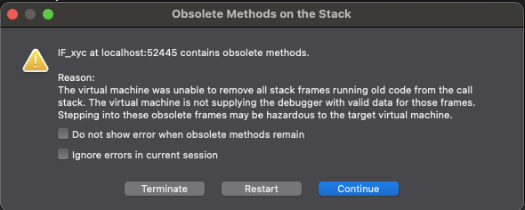
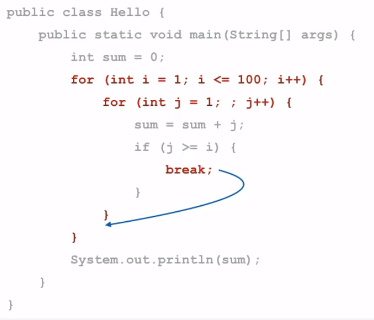
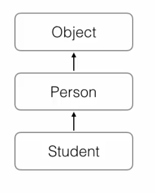

# JavaSE_Basic - Java 基础学习项目  
**（日本語 / English / 中文）**  

---

## 日本語  
### プロジェクト概要  
このプロジェクトは、Java 標準エディション（JavaSE）の基礎知識を学ぶためのサンプルコード集です。  

### 学習内容  
- 変数とデータ型  
- 制御構文（`if`/`for`/`while`）  
- メソッドとクラス  
- オブジェクト指向プログラミング（継承、多態性）  
- 例外処理  
- コレクションフレームワーク（`List`/`Set`/`Map`）  

## 问题记录

[git无法连接的问题](https://blog.csdn.net/zdl177/article/details/119514646?spm=1001.2101.3001.6650.3&utm_medium=distribute.pc_relevant.none-task-blog-2%7Edefault%7EBlogCommendFromBaidu%7ERate-3-119514646-blog-84947403.235%5Ev43%5Epc_blog_bottom_relevance_base7&depth_1-utm_source=distribute.pc_relevant.none-task-blog-2%7Edefault%7EBlogCommendFromBaidu%7ERate-3-119514646-blog-84947403.235%5Ev43%5Epc_blog_bottom_relevance_base7&utm_relevant_index=5)




这是调试器的一个警告提示，不是程序本身的报错。简单解释如下：

这个弹窗在说什么？

标题： Obsolete Methods on the Stack（调用栈中存在“过期方法”）

核心意思：

当前程序的调用栈里，还存在旧版本代码的方法
虚拟机（JVM）无法把这些旧方法从调用栈中移除
如果你继续单步调试，可能会有风险

## switch

switch语句可以做多重选择
switch的计算结果必须是整型、字符串或枚举类型
注意千万不要漏写break, 建议打开fall-through警告
总是写上default, 建议打开missing default警告
尽量少用switch语句

## for

for循环通过计数器进行循环
for循环可以遍历数组
最佳实践：计数器变量定义在for循环内部, 循环体内部不修改计数器
for each循环可以更简单地遍历数组

### break continue



break语句可以跳出当前循环
break语句通常配合if, 在满足条件时提前结束循环
break语句总是跳出最近的一层循环
continue语句可以提前结束本轮循环
continue语句通常配合if, 在满足条件时提前结束本轮循环

## 数组

	Arrays.toString(ns);
	该方法可以快速打印数组

- 遍历数组可以使用for循环
- for (；) 循环可以访问数组索引
- for each循环直接迭代每个数组元素, 无法直接访问索引
- Arrays.toString () 用于快速打印数组内容

	deeptostring 方法
	把“嵌套对象 / 多维数组”的内容，递归地转换成字符串
	
- 多维数组是数组的数组
- 多维数组的每个数组元素长度不要求相同
- 打印多维数组可以使用Arrays.deepToString () 
- 最常见的多维数组是二维数组
- 访问二维数组的一个元素使用array［row］［col］

### 命令行参数

public static void main(String[] args）
中的String[] args
	命令行参数是一个String［］数组
	•由JVM接收用户输入并传给main
	
java Arr_xyc -version -s -t "hello xyc"

```shell
MacBook-Air:bin xuyaochen$ java Arr_xyc -version -s -t "hello xyc"
[I@15db9742
[1, 1, 2, 3, 5, 8]
[28, 12, 89, 73, 65, 18, 96, 50, 8, 36]
[96, 89, 73, 65, 50, 36, 28, 18, 12, 8]
[8, 12, 18, 28, 36, 50, 65, 73, 89, 96]
5
[[I@6d06d69c, [I@7852e922, [I@4e25154f, [I@70dea4e, [I@5c647e05]
[[68, 79, 95, 81], [91, 89, 53, 72], [77, 90, 87, 83], [92, 98, 89, 85], [94, 75, 73, 80]]
Average score: 80
Average score: 76
Average score: 84
Average score: 91
Average score: 80
Average Chinese: 84
Average Math: 86
Average English: 79
Average Physical: 80
Number of args: 4
-version
-s
-t
hello xyc
MacBook-Air:bin xuyaochen$ 
```

- 命令行参数是String［］
- 命令行参数由JVM接收用户输入并传给main方法
- 如何解析命令行参数由程序自己实现

## OOP

面向对象编程：Object-Oriented Programming
对现实世界建立计算机模型的一种编程方法

问题：
No enclosing instance of type OOP_xyc is accessible.
Must qualify the allocation with an enclosing instance of type OOP_xyc 
(e.g. x.new A() where x is an instance of OOP_xy 

你正在 new 一个“非静态内部类”，
但你没有提供它所属的外部类 OOP_xyc 的对象。

class和instance是“模版"和“实例”的关系
class是数据类型, instance是数据
class定义了field, 
每个instance都会拥有各自的field
变量指向instance, ；
并通过变量.字段名访问field
指向instance的变量都是引用变量

## 方法

方法可以让外部代码安全地访问实例字段
方法是一组执行语句
方法内部遇到return时返回
void表示不返回任何值 (注意和返回null不同) 
外部代码通过public方法操作实例
内部代码可以调用private方法

## 方法重载

方法重载 (Overload) 是指：
• **多个方法的方法名相同**
• 但各自的参数不同：
•参数个数不同
• 参数类型不同
• 参数位置不同
• 方法返回值类型通常都是相同的

 string 中 indexOf() 方法
 在字符串中查找某个字符或子串，返回“第一次出现的位置”
```java
 String s = "hello";
int idx = s.indexOf('e');
System.out.println(idx);
 
 String s = "hello world";
int idx = s.indexOf("world");
System.out.println(idx);
 
 String s = "banana";
int idx = s.indexOf("a", 2);
System.out.println(idx);
```

## 继承

• Student可以从Person继承
• 继承使用关键字extends
• Student获得了Person的所有功能
• Student只需要编写新增的功能
 
 
• Person类定义的private字段无法被子类访问
- 用protected修饰的字段可以被子类访问
- protected把字段和方法的访问权限控制在继承树内部

### super

- super关键字表示父类 (超类) 
- 构造方法的第一行语句必须调用super () 
- 没有super () 时编译器会自动生成super () 
- 如果父类没有默认构造方法, 子类就必须显式调用super () 

### 向上转型



把子类安全的转为更加抽象的类型

### 向下转型

可以对实例变量进行向下转型 (downcasting) 
向下转型把抽象的类型变成一个具体的子类型
向下转型很可能报错：ClassCastException

总结

继承是面向对象编程的一种代码复用方式
Java只允许单继承
protected允许子类访问父类的字段和方法
子类的构造方法可以通过 super () 调用父类的构造方法
可以安全地向上转型为更抽象的类型
可以强制向下转型, 最好借助 instanceof 判断
子类和父类的关系是is, has关系不能用继承

## 多态

- Java的实例方法调用是基于运行时实际类型的动态调用
- 多态是指针对某个类型的方法调用, 其真正执行的方法取决于运行时期实际类型的方法
- 对某个类型调用某个方法, 执行的方法可能是某个子类的覆写方法
- 利用多态, 允许添加更多类型的子类实现功能扩展


super 可以调用父类的方法

```java
	public String hello() {
		return super.hello()+"我是学生";
	}
```

### final方法

final与访问权限不冲突
用final修饰class可以阻止被继承
用final修饰method可以阻止被覆写

被 final 修饰的方法，不能被子类重写（override）
二、为什么要用 final 方法？


主要有 3 个目的：
1️⃣ 防止子类“乱改”核心逻辑
class Parent {
    public final void rule() {
        System.out.println("核心规则");
    }
}
class Child extends Parent {
    // ❌ 编译错误，不能重写
    public void rule() {}
}
👉 保证行为不被破坏
2️⃣ 设计上“不希望被扩展”
工具方法
安全相关逻辑
模板方法中的关键步骤 


子类可以覆写父类的方法 (Override) 
覆写在子类中改变了父类方法的行为
多态：Java的方法调用总是作用于对象的实际类型
final修饰的方法可以阻止被覆写
final修饰的class可以阻止被继承
final修饰的field必须在创建对象时初始化


## 抽象类

**抽象方法**是 Java OOP 里一个**非常核心、但一开始容易“抽象过头”**的概念。

---
## 一、一句话理解抽象方法

> **抽象方法：只规定“要做什么”，不规定“怎么做”**

---

## 二、什么是抽象方法？

### 定义特点

```java
public abstract void pay();
```

* 有方法声明
* **没有方法体**
* 用 `abstract` 修饰

---

### 抽象方法所在位置

👉 **只能在抽象类中**

```java
public abstract class Payment {
    public abstract void pay();
}
```

---

## 三、基本规则（必考）

### ✅ 必须遵守的规则

1️⃣ 含有抽象方法的类 **必须是抽象类**

2️⃣ 子类 **必须实现所有抽象方法**
（除非子类本身也是抽象类）

```java
class AliPay extends Payment {
    @Override
    public void pay() {
        System.out.println("支付宝支付");
    }
}
```

---

### ❌ 不允许的

```java
abstract class A {
    public abstract void test() {} // ❌ 抽象方法不能有方法体
}
```

```java
abstract final class A {} // ❌ 抽象类不能是 final
```

---

## 四、抽象方法在实际业务中的应用（重点）
### 🌰 业务场景：支付系统（非常经典）

#### 1️⃣ 抽象父类（定义规范）

```java
public abstract class Payment {

    // 抽象方法：每种支付方式必须实现
    public abstract void pay(int amount);

    // 公共逻辑
    public void log() {
        System.out.println("记录支付日志");
    }
}
```

---

#### 2️⃣ 子类实现不同业务

```java
class AliPay extends Payment {
    @Override
    public void pay(int amount) {
        System.out.println("支付宝支付：" + amount);
    }
}
```

```java
class WeChatPay extends Payment {
    @Override
    public void pay(int amount) {
        System.out.println("微信支付：" + amount);
    }
}
```

---

#### 3️⃣ 业务方调用（解耦关键）

```java
public void doPay(Payment payment) {
    payment.pay(100);
}
```

👉 **业务层不关心具体实现**

---

## 五、为什么业务中一定要用抽象方法？

### 1️⃣ 解耦（最重要）

* 新增支付方式
* 不改原代码
* 只加新子类

👉 **符合开闭原则**

---

### 2️⃣ 强制规范

> “你要接入支付？那你必须实现 `pay()`”

---

### 3️⃣ 更利于维护 & 扩展

* 删除 if-else
* 少改老代码
* 风险更低

---

## 六、抽象方法 vs 接口（简单对比）

| 对比点  | 抽象方法    | 接口                 |
| ---- | ------- | ------------------ |
| 所在位置 | 抽象类     | 接口                 |
| 成员变量 | 可以有普通字段 | 只能是常量              |
| 方法实现 | 可以有普通方法 | Java 8+ 可有 default |
| 适用场景 | 有共性实现   | 只定义能力              |

---

## 七、一个生活类比（超好记）

> **抽象方法 = 菜谱
> 具体类 = 厨师**

菜谱告诉你做什么菜，不教你具体怎么炒。

---

## 八、一句话总结（面试用）

> **抽象方法定义规范，子类实现细节，用于业务解耦和扩展**


## 接口

如果一个抽象类没有字段, 所有方法全部是抽象方法,
就可以把该抽象类改写为接口 (interface) 

使用interface声明一个接口

| 对比项 | abstract class | interface |
|------|---------------|-----------|
| 继承 | 只能 extends 一个 class | 可以 implements 多个 interface |
| 字段 | 可以定义实例字段 | 不能定义实例字段 |
| 抽象方法 | 可以定义抽象方法 | 可以定义抽象方法 |
| 非抽象方法 | 可以定义非抽象方法 | 可以定义 default 方法 |


• 接口定义了纯抽象规范
• 类可以实现多个接口
• 接口也是数据类型, 适用于向上转型和向下转型
• 接口不能定义实例字段
• 接口可以定义default方法 (JDK>=1.8) 

## 静态字段 static

所有实例共享一个静态字段
不推荐用实例变量访问静态字段
推荐用类名访问静态字段
可以把静态字段理解为描述class
本身的字段 (非实例字段) 

静态方法经常用于工具类
• Arrays.sort () 
• Math.random () 
静态方法经常用于辅助方法
Java程序的入口main () 也是静态方法

## 包 package

JVM只看完整类名, 因此, 只要包名不同, 类就不同：
• xiaoming.Person
• xiaohong.Person
包可以是多层结构
• java.util.Arrays
包没有父子关系

Java内建的package机制是为了避免class命名冲突
JDK的核心类使用java.lang包
JDK的其它常用类定义在java.util.*, 
, Java.math.*
, java.text.* …..
包名推荐使用倒置的域名, 例如 org.apache


## 访问权限

1️⃣ private（私有）
作用范围：仅在当前类中可访问

3️⃣ protected（受保护）
作用范围：同包 + 不同包的子类

4️⃣ public（公共）
作用范围：任何地方都可访问

package 访问权限（Package-Private） 指的是：
> 只允许同一个 package（包）中的类访问

## classpath 

• classpath是一个环境变量
•classpath指示JVM如何搜索class
•classpath设置的搜索路径与操作系统相关：
• C:worklproject1\bin;C:Ishared；"D：\My Documentlproject2\bin"
• /usr/shared:/usr/local/bin:/home/feiyangedu/bin

• 假设classpath是.；C：：\worklproject1\bin;C：|shared
• JVM在加载com.feiyangedu.Hello这个类时, 依次查找：
• ＜当前目录>lcomlfeiyangedu\Hello.class
• C:lworklproject1\binlcomlfeiyangedu\Hello.class
• C:sharedlcomlfeiyangedu\Hello.class
• 在某个路径下找到了, 就不再继续搜索
•如果都没有找到, 报错

classpath的设定方法：
• 直接在系统环境中设置classpath环境变量 (不推荐) 
• 在启动JVM时设置classpath变量 (推荐) ：
• java -classpath C:lworklbin;C:Ishared com.feiyangedu.Hello
• java -cp C: worklbin;C:shared com.feiyangedu.Hello
•没有设置环境变量, 也没有设置-Cp参数, 默认的classpath为•, 即当前目录
• 在Eclipse中运行Java程序, 
Eclipse自动传入的-cp参数是当前工程的bin目录和引入的jar

## jar包

jar包是zip格式的压缩文件, 包含若干.class文件
jar包相当于目录
classpath可以包含jar文件：C:lworklbinlall.jar
查找com.feiyangedu.Hello类将在C:Wworklbinlall.jar文件中搜索
com/feiyangedu/Hello.class
使用jar包可以避免大量的目录和.class文件

如何创建jar包：
• 使用JDK自带的jar命令
• 使用构建工具如Maven等

• jar包可以包含一个特殊的/META-INF/MANIFEST.MF文件
• MANIFEST.MF是纯文本, 可以指定Main-Class和其它信息
•jar包还可以包含其它jar包

• JVM运行时会自动加载JDK自带的class
• JDK自带的class被打包在rt.jar
• 不需要在classpath中引用rt,jar


**可以先压缩成zip文件 然后 重命名为 .jar**

find . -name testxyc.jar

```shell
MacBook-Air:src xuyaochen$ java -cp testxyc.jar com.xyc.Abstract_xyc
180.0
36.31681107549801
Hello, World!
MacBook-Air:src xuyaochen$ 
```

-cp（或 -classpath）

📌 作用：
告诉 JVM：到哪里去找要运行的 class
也就是把 testxyc.jar 加入 类加载路径（Classpath）

打jar包是遇到的问题 

正确的 jar 结构应该长这样
META-INF/
└── MANIFEST.MF
com/
└── xyc/
    ├── Abstract_xyc.class
    ├── Circle.class
    ├── Hello.class
    ├── Rect.class
    ├── Shape.class
    └── ShapeUtil.class
    
    
运行一定要是 .class文件 而不是 .java文件

要在bin目录下 用class打jar包

MacBook-Air:src xuyaochen$ java -jar testmani.jar 
180.0
36.31681107549801
Hello, World!
MacBook-Air:src xuyaochen$ 

## MANIFEST

一、MANIFEST 文件是什么？
MANIFEST.MF 是 JAR 包的元数据说明文件。
固定位置：
META-INF/MANIFEST.MF

本质：纯文本文件
JVM / 工具通过它了解：
这个 jar 是干嘛的
从哪开始执行
依赖和版本信息
📌 可以把它理解为：
jar 包的“说明书 / 入口配置文件”

• JVM通过环境变量classpath决定搜索class的路径和顺序
• 不推荐设置系统环境变量classpath, 始终建议通过-cp命令传入
• jar包相当于目录, 可以包含很多class文件, 方便下载和使用
• META-INF/MANIFEST.MF可以提供jar包的信息, 如Main-Class
• 不需要在classpath中引用包含Java核心类的rt.jar


## string

- equals (Object) 
- equalslgnoreCase (String) //忽略大小写比较string的内容

是否包含子串：
• boolean contains (CharSequence) 
• int indexOf (String) 
• int lastlndexOf (String) 
• boolean startsWith (String) 
• boolean endsWith (String) 

trim () 方法
- 移除首尾空白字符
- 空格, It, V, In
注意：trim () 不改变字符串内容, 而是返回新字符串

提取子串
substring () 
大小写转换
• toUpperCase () 
• toLowerCase () 

替换子串
• replace (char, char)  //替换一个字符
• replace (CharSequence, CharSequence)  //替换一串字符
正则表达式替换子串
• replaceAll (String, String) 
分割字符串
• Stringl[] split (String) 

拼接字符串
• static String join () 

把任意数据转换为String：
• static String valueOf (int) 
static String valueOf (boolean) 
• static String valueOf (Object) 
把String转换为其它类型：
• static int Integer.parselnt (String) 
• static Integer Integer.valueOf (String) 

String转换为char[]

char[] toCharArray () 
char［］转换为String：
• new String(char[])

String转换为byte［］
• bytell getBytes () 不推荐
• bytell getBytes (String) 
• bytel］ getBytes (Charset) 
byte［转换为String：
• new String (byte［］, String) 
• new String (byte ［］, Charset) 

• 字符串是不可变对象
• 字符串操作不改变原字符串内容, 而是返回新字符串
• 常用的字符串操作：提取子串、查找、替换、大小写转换等
• 字符串和byte［］互相转换时要注意编码, 建议总是使用UTF-8编码

## string builder
针对于大量零碎的字符串拼接

String可以用＋拼接
• 每次循环都会创建新的字符串对象
•绝大部分都是临时对象, 浪费内存
•影响GC效率

StringBuilder可以高效拼接字符串
• StringBuilder是可变对象
• StringBuilder可以预分配缓冲区

不需要特别改写字符串＋操作
编译器在内部自动把多个连续的+
操作优化StringBuilder操作

StringBuilder和StringBuffer接口完全相同
StringBuffer是StringBuilder的线程安全版本
没有必要使用StringBuffer

• StringBuilder是可变对象, 用来高效拼接字符串
• StringBuilder可以支持链式操作
• 实现链式操作的关键是返回实例本身
• StringBuffer是StringBuilder的线程安全版本, 很少使用

## 包装类

定义一个Integer类, 包含一个实例
字段int
• 可以把Integer视为int的包装类型
 (wrapper) 
 
 | 基本类型 | 对应的包装类型 |
|----------|----------------|
| boolean  | Boolean        |
| byte     | Byte           |
| short    | Short          |
| int      | Integer        |
| long     | Long           |
| float    | Float          |
| double   | Double         |
| char     | Character      |
 
 编译器可以自动在int和Integer之间
转型：
• 自动装箱：auto boxing
int-> Integer
• 自动拆箱：auto unboxing
Integer-> Int

• 自动装箱和自动拆箱只发生在编译阶段
• 装箱和拆箱会影响执行效率
•编译后的class代码是严格区分基本类型和引用类型的
• Integer -> int 执行时可能会报错

JDK的包装类型可以把基本类型包装class
自动装箱和自动拆箱是编译器完成的 (JDK>=1.5) 
装箱和拆箱会影响执行效率
注意拆箱时可能发生NullPointerException

## JavaBean

符合命名规范的class被称JavaBean
• private Type field
• public Type getField () 
• public void setField (Type value) 
注意方法名称的大小写

通常把一组对应的getter和setter称
属性 (Property) ：
• name属性：
• 对应读方法getName () 
• 对应写方法setName () 

JavaBean是一种符合命名规范的class
JavaBean通过getter/setter来定义属性
属性是一种通用的叫法, 并非Java语法规定
可以利用IDE快速生成getter/setter
使用Introspector.getBeanlnfo () 获取属性列表


Introspector 是 Java 提供的内省工具类，
用来按照 JavaBean 规范分析类的属性、getter、setter 方法。


## 一、一句话介绍（先记这个）
> **`Introspector` 是 Java 提供的内省工具类，用来按照 JavaBean 规范分析类的属性、getter、setter 方法。**
---

## 二、Introspector 是什么？

* 包名：

```java
java.beans.Introspector
```

* 它是 **Java 内省（Introspection）机制的入口类**
* 专门用于 **分析 JavaBean**
* 关注点是：

  * 属性（Property）
  * getter / setter
  * 事件（不常用）

👉 和反射不同，它**不是随便扫方法**，而是**按 JavaBean 规范来理解类**。

---

## 三、Introspector 能做什么？

### 1️⃣ 解析 JavaBean 的“属性”

```java
Introspector.getBeanInfo(Person.class);
```

它能识别：

```java
getName()   → name
setAge()    → age
isActive()  → active（boolean）
```

并生成对应的：

```java
PropertyDescriptor
```

---

### 2️⃣ 找到 getter / setter 方法

```java
PropertyDescriptor pd;
pd.getReadMethod();   // getter
pd.getWriteMethod();  // setter
```

👉 框架通过它来：

* 读对象属性
* 写对象属性

---

### 3️⃣ 统一属性访问方式（不直接依赖字段）

* 不关心字段是不是 `private`
* 只关心 **对外暴露的行为（方法）**

这是 **面向对象设计的核心思想**。

---

## 四、核心 API（面试常问）

### 1️⃣ 获取 BeanInfo

```java
BeanInfo info = Introspector.getBeanInfo(Person.class);
```

---

### 2️⃣ 获取所有属性描述器

```java
PropertyDescriptor[] pds = info.getPropertyDescriptors();
```

---

### 3️⃣ 排除父类的属性（进阶）

```java
Introspector.getBeanInfo(Person.class, Object.class);
```

👉 不再返回 `class` 属性

---

## 五、Introspector vs 反射（重点对比）

| 对比点                | Introspector | Reflection |
| ------------------ | ------------ | ---------- |
| 面向对象程度             | 高（基于规范）      | 低（直接操作）    |
| 是否依赖 getter/setter | ✅ 是          | ❌ 否        |
| 是否操作字段             | ❌ 不直接操作      | ✅ 可以       |
| 框架友好度              | ⭐⭐⭐⭐⭐        | ⭐⭐⭐        |

📌 所以：

> **Spring、MyBatis 更偏向使用内省，而不是直接反射字段**

---

## 六、典型使用场景（你已经见过了）

* Spring：依赖注入
* MyBatis：结果映射
* Jackson：JSON 序列化
* BeanUtils：属性拷贝

---

## 七、常见坑（你刚好已经踩过一些）

### ❌ 误以为 Introspector 能看到所有字段

👉 错，只认 **getter / setter**

---

### ❌ 忘记过滤 `class` 属性

👉 正确方式：

```java
Introspector.getBeanInfo(Person.class, Object.class);
```

---

## 八、面试标准总结（可直接背）

> `Introspector` 是 Java 提供的 JavaBean 内省工具类，
> 用于按照 JavaBean 规范解析类的属性信息，
> 获取属性对应的 getter 和 setter 方法，
> 广泛用于 Spring 等框架中进行属性操作。
---

## enum
用enum定义常量：
- 关键字enum定义常量类型
• 常量本身带有类型信息
• 使用== 比较：
• if (day == Weekday.FRI) ｛...｝

enum定义的类型实际上是class
•继承自java.lang.Enum
• 不能通过 new 创建实例
• 所有常量都是唯一实例 (引用类型) 
• 可以用于switch语句

•enum可以定义常量类型, 它被编译器编译为：
final class Xxx extends Enum ｛...｝
• name () 获取常量定义的字符串, 注意不要使用toString () 
• ordinal () 返回常量定义的顺序 (无实质意义) 
• 可以为enum类编写构造方法、字段和方法
• 构造方法申明为private并且是从应用内继承下来的。

## 常用工具类

* Math：数学计算
* Random：生成伪随机数
* SecureRandom：生成安全的随机数
* BigInteger：表示任意大小的整数
* BigDecimal：表示任意精度的浮点数

Math提供了数学计算的静态方法：
• abs /min / max
• pow / sqrt/exp / log /log10
• sin / cos / tan / asin / acos ..
常量：
• Pl = 3.14159..
• E= 2.71828.

Random用来创建伪随机数
nextlnt / nextLong / nextFloat ...
• nextlnt (N) 生成不大于N的随机数

什么是伪随机数
• 给定种子后伪随机数算法会生成完全相同的序列
• 不给定种子时Random使用系统当前时间戳作为种子

Biglnteger用任意多个int］来表示非常大的整数

## 异常

Error是发生了严重错误, 程序对此一般无能为力：
OutOfMemoryError, NoClassDefFoundError, StackOverflowError ..
Exception是发生了运行时逻辑错误, 应该捕获异常并处理：
捕获并处理错误：IOException, NumberFormatException ...
修复程序：NullPointerException, IndexOutOfBoundsException ...

• Java使用异常来表示错误, 并通过try｛..｝catch｛•｝捕获异常
• Java的异常是class, 并且从Throwable继承
• Error是无需捕获的严重错误
•Exception是应该捕获的可处理的错误
• RuntimeException无需强制捕获, 非RuntimeException (Checked
Exception) 需强制捕获, 或者用 throws声明JAVA的异常

### 捕获异常
 
捕获异常使用try...catch
catch会捕获对应的Exception及其子类
多个catch子句从上到下匹配
顺序非常重要，子类必须在前
finally保证有无错误都会执行
finally可选
使用multi-catch捕获多种类型异常


try ｛...｝ catch () ..｝

使用try.catch捕获异常
可能发生异常的语句放在try｛.｝中
使用catch捕获对应的Exception及其子类

可以使用多个catch子句：
• 每个catch捕获对应的Exception及其子类
•从上到下匹配, 匹配到某个catch后不再继续匹配

可以同时捕捉两种异常

catch (IOException | NumberFormatException e) 

//用来把异常的“调用栈信息”打印到控制台，方便定位错误发生的位置。
e.printStackTrace();

如何获取所有的异常信息？
用getSuppressed () 获取所有
Suppressed Exception

```java
		try {
		    somethingWrong("");
		} catch (Exception e) {
		    e.printStackTrace();

		    for (Throwable t : e.getSuppressed()) {
		        t.printStackTrace();
		    }
		}
```

printStackTrace () 可以打印异常的传播栈, 对于调试非常有用
捕获异常并再次抛出新的异常时, 应该持有原始异常信息
如果在finally中抛出异常, 应该把新抛出的异常添加到原有异常中
用getSuppressed () 可以获取所有添加的Suppressed Exception
处理Suppressed Exception要求JDK>=1.7

JDK定义的常用异常：
• RuntimeException
• NullPointerException
• IndexOutOfBoundsException
• SecurityException
• IllegalArgumentException
• NumberFormatException
• IOException
• UnsupportedCharsetException, FileNotFoundException, SocketException...
• ParseException, GeneralSecurityException, SQLException, TimeoutException

## 断言和日志

### 断言 Assertion
 
断言使用assert语句
 
JVM默认关闭断言指令：
 
* 给Java虚拟机传递-ea参数启用断言
* 可以指定特定的类启用断言 -ea:com.feiyangedu.sample.Main
* 可以指定特定的包启用断言 -ea:com.feiyangedu... 
 
特点：
 
* 断言是一种调试方式，断言失败会抛出AssertionError，导致程序退出
* 只能在开发和测试阶段启用断言
* 对可恢复的错误不能使用断言，而应该抛出异常
* 断言很少被使用，更好的方法是编写单元测试

输出结果：
Exception in thread "main" java.lang.AssertionError: x must >= 0 but x = -123.45
	at com.xyc.Abstract_xyc.main(Abstract_xyc.java:66)
	
### 日志 Logging
 
* 日志是为了替代System.out.println()，可以定义格式，重定向到文件等
* 日志可以存档，便于追踪问题
* 日志记录可以按级别分类，便于打开或关闭某些级别
* 可以根据配置文件调整日志，无需修改代码
 
JDK提供了Logging：java.util.logging
 
JDK Logging定义了7个日志级别：
 
* SEVERE
* WARNING
* INFO （默认级别）
* CONFIG
* FINE
* FINER
* FINEST
 
JDK Logging的局限：
 
* JVM启动时读取配置文件并完成初始化
* JVM启动后无法修改配置
* 需要在JVM启动时传递参数 -Djava.util.logging.config.file=config-file-name

### Commons Logging
 
Commons Logging是Apache创建的日志系统：
 
* Commons Logging是使用最广泛的日志模块
* Commons Logging的API非常简单
* Commons Logging可以自动使用其他日志模块
 
Commons Logging定义了6个日志级别：
 
* FATAL
* ERROR
* WARNING
* INFO （默认级别）
* DEBUG
* TRACE
 
在Eclipse中引入jar包：
 
Project -> Property -> Java Build Path -> Libraries -> Add Jars...
 
初始化Log对象：
 
```
final Log log = LogFactory.getLog(getClass());
```
 
文档：http://commons.apache.org/proper/commons-logging/


### Log4j

Log4j的概念：

* Appender
* Filter
* Layout

使用Log4j：

* 通过Commons Logging实现日志，不需要修改代码即可使用Log4j
* 使用Log4j只需要把log4j2.xml和相关jar放入classpath
* 如果要更换Log4j，只需要移除log4j2.xml和相关jar
* 只有扩展Log4j时，才需要引用Log4j的接口

文档：http://logging.apache.org/log4j/

### class
 
class本身是一种数据类型（Type），class/interface的数据类型是Class，
JVM为每个加载的class创建唯一的Class实例。
 
Class实例包含该class的所有信息，
== 通过Class实例获取class信息的方法称为反射（Reflection）==
 
获取一个class的Class实例：
 
* Class cls = String.class;
* Class cls = "str".getClass();
* Class cls = Class.forName("java.lang.String");
 
注意Class的==比较和`instanceof`的区别。
 
从Class实例获取class信息：
 
* getName()
* getSimpleName()
* getPackage()
 
从Class实例判断class类型：
 
* isInterface()
* isEnum()
* isArray()
* isPrimitive()
 
创建class实例：
 
cls.newInstance()
 
JVM总是动态加载class，可以在运行期根据条件控制加载class。

反射的目的是当获得某个Object实例时, 我们可以获取该Object的class信息


好问题 👍
**反射**在 Java 里一开始确实有点“玄学”，但放到真实业务场景里，其实非常实用。我用**通俗 + 业务例子**给你拆开讲。

---

## 反射

## 一句话先理解反射是啥

> **反射 = 在“运行时”，去获取类的信息，并且“操作”这个类（创建对象、调方法、读写属性）**

正常写 Java 是这样的（**编译期就确定**）：

```java
User user = new User();
user.setName("Tom");
```

反射是这样的（**运行时才知道是谁**）：

```java
Class<?> clazz = Class.forName("com.xxx.User");
Object obj = clazz.newInstance();
Method m = clazz.getMethod("setName", String.class);
m.invoke(obj, "Tom");
```

👉 **类名、方法名，都是字符串，运行时才确定**

---

## 为什么业务中“非用反射不可”？
希望在不修改源码的情况下 让代码变化
因为实际的项目你想修改代码要拉分支修改，推上去，再编译，开发环境部署测试，上线，成本非常高

(https://www.bilibili.com/video/BV1h836z5Egs/?spm_id_from=333.337.search-card.all.click&vd_source=4fd29620ab97a080af7ee392e19b0fcb)
### 核心原因一句话：

> **业务中经常：代码写的时候，不知道将来会用到哪个类 / 哪个方法**


## 场景 2：通用接口 + 多实现（策略模式的升级版）

### 业务场景

比如：**不同支付方式**

```text
alipay
wechat
paypal
```

### 传统写法（if-else 地狱）

```java
if ("alipay".equals(type)) {
    return new AliPayService();
} else if ("wechat".equals(type)) {
    return new WechatPayService();
}
```

### 用反射（+ 配置）

```properties
alipay=com.xxx.AliPayService
wechat=com.xxx.WechatPayService
```

```java
String className = config.get(type);
Class<?> clazz = Class.forName(className);
PayService payService = (PayService) clazz.newInstance();

//软编码
String className = "com.xxx.Dog"；
Class clazz = Class.forName (className) ；
Object obj = clazz.newInstance () ；
Method method = clazz.getMethod ("m1") ；
method.invoke (obj) ；
```

👉 **新增支付方式不用改代码，只加类 + 配置**

✅ 非常符合业务扩展
❌ 没反射就做不到这么“通用”

---


## 一句话业务总结（你可以记住）

> 反射解决的是：
> **“代码写的时候不知道用谁，但运行的时候一定要用对的人”**


JVM为每个加载的class创建对应的Class实例来保存class的所有信息
获取一个class对应的Class实例后, 就可以获取该class的所有信息
通过Class实例获取class信息的方法称为反射 (Reflection) 
JVM总是动态加载class, 可以在运行期根据条件控制加载class


### Field
Field用来在运行时，读取 / 修改对象的成员变量
通过Class实例获取字段field信息：
 
* getField(name)：获取某个public的field（包括父类）
* getDeclaredField(name)：获取当前类的某个field（不包括父类）
* getFields()：获取所有public的field（包括父类）
* getDeclaredFields()：获取当前类的所有field（不包括父类）
 
Field对象包含一个field的所有信息：
 
* getName()
* getType()
* getModifiers()
 
获取和设置field的值：
 
* get(Object obj)
* set(Object, Object)
 
通过反射访问Field需要通过SecurityManager设置的规则。
 
通过设置setAccessible(true)来访问非public字段。

| 修饰符       | 是否能反射            |
| --------- | ---------------- |
| public    | 直接访问             |
| protected | 需要 setAccessible |
| default   | 需要 setAccessible |
| private   | 必须 setAccessible |


### Method
 
通过Class实例获取方法Method信息：
 
* getMethod(name, Class...)：获取某个public的method（包括父类）
* getDeclaredMethod(name, Class...)：获取当前类的某个method（不包括父类）
* getMethods()：获取所有public的method（包括父类）
* getDeclaredMethods()：获取当前类的所有method（不包括父类）
 
Method对象包含一个method的所有信息：
 
* getName()
* getReturnType()
* getParameterTypes()
* getModifiers()
 
调用Method：
 
* Object invoke(Object obj, Object... args)

invoke 用来“在运行时调用某个方法”
 
通过设置setAccessible(true)来访问非public方法。
 
反射调用Method也遵守多态的规则。

👉「我在写代码时，知道我要调用哪个方法吗？」

✅ 知道 → 不用 invoke
❌ 不知道 → 只能 invoke

invoke 是一个动词，核心意思是：
调用 / 唤起 / 请求执行


### Constructor

调用public无参数构造方法：

* Class.newInstance()

通过Class实例获取Constructor信息：

* getConstructor(Class...)：获取某个public的Constructor
* getDeclaredConstructor(Class...)：获取某个Constructor
* getConstructors()：获取所有public的Constructor
* getDeclaredConstructors()：获取所有Constructor

通过Constructor实例可以创建一个实例对象：

* newInstance(Object… parameters)

通过设置setAccessible(true)来访问非public构造方法。


### 继承关系
 
获取父类的Class：
 
* Class getSuperclass()
* Object的父类是null
* interface的父类是null
 
获取当前类直接实现的interface：
 
* Class[] getInterfaces()
* 不包括间接实现的interface
* 没有interface的class返回空数组
* interface返回继承的interface
 
判断一个向上转型是否成立：
 
* bool isAssignableFrom(Class)

### 注解
 
注解（Annotation）是放在Java源码的类、方法、字段、参数前的一种标签。
 
注解本身对代码逻辑没有任何影响，如何使用注解由工具决定。
 
编译器可以使用的注解：
 
* @Override
* @Deprecated
* @SuppressWarnings
 
注解可以定义配置参数和默认值。

•@Override：让编译器检查该方法是否正确地实现了覆写
•@Deprecated：告诉编译器该方法已经被标记为“作废”, 在其他地方引用将会出现编译警告
•@SuppressWarnings ：用来“告诉编译器：这个警告我知道，可以先别提示我”


### 定义注解
 
使用@interface定义注解（Annotation）。
 
使用元注解定义注解：
 
* @Target ：限制注解的使用位置
* @Retention ：决定注解的生命周期
* @Repeatable ：允许同一个注解在同一位置重复使用
* @Inherited ：子类是否自动继承父类的注解
 
定义Annotation的步骤：
 
1. 用@interface定义注解
2. 用元注解（meta annotation）配置注解
  * Target：必须设置
  * Retention：一般设置为RUNTIME
  * 通常不必写@Inherited, @Repeatable等等
3. 定义注解参数和默认值

使用@Retention定义Annotation的生命周期：
• 仅编译期：RetentionPolicy.SOURCE
• 仅Class文件：RetentionPolicy.CLASS
• 运行期：RetentionPolicy.RUNTIME
如果@Retention不存在, 则该Annotation默认为CLASS
通常自定义的Annotation都是RUNTIME

定义Annotation的步骤：
• 用@interface定义注解
用元注解 (meta annotation) 配置注解
• Target：必须设置
• Retention：一般设置为RUNTIME
• 通常不必写@Inherited, @Repeatable等等
•定义注解参数和默认值

https://www.bilibili.com/video/BV1qi421h7y7/?spm_id_from=333.337.search-card.all.click&vd_source=4fd29620ab97a080af7ee392e19b0fcb


### 处理注解

使用反射API读取Annotation：

* Class.isAnnotationPresent(Class)
* Field.isAnnotationPresent(Class)
* Method.isAnnotationPresent(Class)
* Constructor.isAnnotationPresent(Class)
* Class.getAnnotation(Class)
* Field.getAnnotation(Class)
* Method.getAnnotation(Class)
* Constructor.getAnnotation(Class)
* getParameterAnnotations()

可以通过工具处理注解来实现相应的功能：

* 对JavaBean的属性值按规则进行检查
* JUnit会自动运行@Test标记的测试方法

• 注解本身对代码逻辑没有任何影响
• SOURCE类型的注解在编译期就被丢掉了
• CLASS类型的注解仅保存在class文件中
• RUNTIME类型的注解在运行期可以被读取
• 如何使用注解由工具决定


这个问题问得**非常到位**，已经是**“写业务 vs 写工程”**的分水岭了 👍
我不先站队，先说结论，再慢慢拆。

---

# 一、先给结论（直接版）

```java
if (age < 1 || age > 120) {
    throw new IllegalArgumentException("年龄不合法");
}
```

👉 **不是“不好”，而是：**

* ✔️ 对**小 demo / 一次性代码**完全 OK
* ❌ 对**真实业务 / 长期维护系统**非常不友好

注解的好处不是“少写一行 if”，
而是 **让规则集中、可复用、可扩展、可被框架接管**。

---

# 二、这个 if 写法到底“差”在哪？（真实痛点）

## 1️⃣ 规则分散（最致命的问题）

想象一下这些地方都要校验年龄：

* 注册接口
* 修改资料接口
* 后台导入用户
* 单元测试造数据
* MQ 消费

结果就是 👇

```java
if (age < 1 || age > 120) { ... }
```

在 **N 个地方复制粘贴**

### 后果

* 改规则（120 → 150）要改 N 个地方
* 很容易漏改
* 出 bug 还不好排查

---

## 2️⃣ 规则和业务代码“搅在一起”

```java
public void register(User user) {
    if (age < 1 || age > 120) { ... }   // 校验
    saveUser(user);                     // 业务
    sendMsg(user);                      // 业务
}
```

问题是：

* 校验代码 ≠ 业务逻辑
* 可读性差
* 新人接手很痛苦

---

## 3️⃣ 无法通用、无法抽象

你很快就会遇到：

* 年龄
* 分数
* 次数
* 金额

都要范围校验：

```java
if (score < 0 || score > 100) { ... }
if (count < 1 || count > 10) { ... }
if (price < 0 || price > 9999) { ... }
```

👉 **每个都要自己写 if**

---

## 4️⃣ 很难“统一处理异常”

* 错误信息不统一
* 前端不好对接
* 返回格式不一致

---

# 三、那注解到底“好”在哪？（核心价值）

## 1️⃣ 规则“贴”在数据上（非常关键）

```java
public class UserDTO {

    @Range(min = 1, max = 120)
    private int age;
}
```

👉 一眼就能看出：

> age 的合法范围是多少

这叫：**规则自描述**

---

## 2️⃣ 校验逻辑集中管理（工程级）

```java
RangeChecker.check(user);
```

* 所有范围校验都走这里
* 改规则只动注解
* 校验逻辑只写一遍

---

## 3️⃣ 可扩展（这是 if 永远做不到的）

以后你想加：

```java
@NotNull
@Range(min = 1, max = 120)
@Sensitive
private int age;
```

而 if 写法只能：

```java
if (age == null) ...
if (age < 1 || age > 120) ...
```

---

## 4️⃣ 可以被框架“接管”（最重要）

Spring / Hibernate Validator 能：

* 自动校验
* 自动返回错误信息
* 自动国际化
* 自动和 Controller 绑定

```java
@PostMapping("/register")
public void register(@Valid UserDTO user) {
    // 根本不用写 if
}
```

👉 这才是**生产级代码**

---

# 四、一个非常关键的认知纠正

> ❌ 注解不是为了“少写代码”
> ✅ 注解是为了 **“让规则标准化”**

---

# 五、什么时候 **不用** 注解，直接 if 就好？

你这个问题问得成熟，我也要讲清楚边界。

### ✔️ 用 if 就好的场景

* 临时脚本
* 小工具
* Demo
* 极简单逻辑（一次用）

### ❌ 不建议用 if 的场景

* 校验规则多
* 多入口
* 要长期维护
* 用 Spring / 微服务

---

# 六、总结（你可以直接背）

> 直接使用 if 判断在小规模代码中没有问题，
> 但在真实业务中会导致校验规则分散、
> 与业务逻辑耦合严重、
> 难以维护和扩展。
>
> 使用注解可以将校验规则声明在数据模型上，
> 通过统一的校验器或框架在运行时处理，
> 提高代码的可读性、可维护性和扩展性。


Syntax error, insert "EnumBody" to complete EnumDeclaration
Syntax error, insert "enum Identifier" to complete EnumHeaderName

注解这里不能加 分号

field 英文原意

field = 字段 / 域
在编程里它表示：
类里面定义的成员变量

```java
public class Person {

    public int age;        // 👈 这是一个 field
    private String name;   // 👈 这也是 field

    public void run() { }  // ❌ 这是 method，不是 field
}

```


